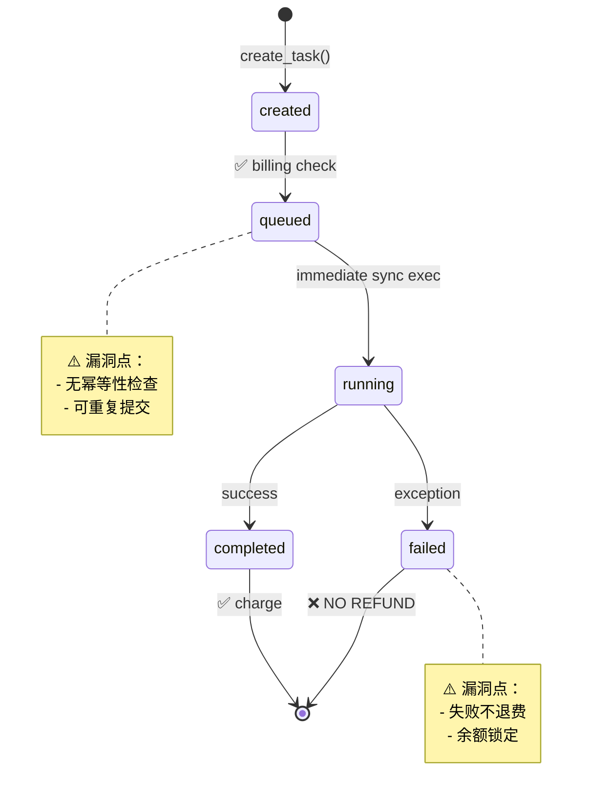
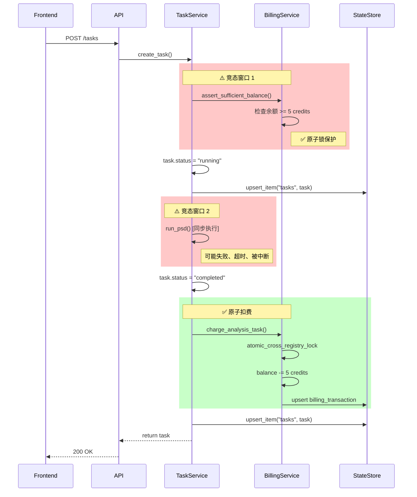

# Agent 3 对抗性安全评审报告
# 任务提交 + 结果生成流程安全审计

**项目**: quanlan-analyser-official  
**评审时间**: 2026-07-02  
**评审范围**: 任务提交、结果生成、扣费流程  
**评审方法**: 16 项对抗性测试场景模拟

---

## 执行摘要

本次安全审计针对 QLanalyser 的核心交易流程（任务提交→执行→扣费→结果下载）进行了系统性对抗测试，发现 **8 个高危漏洞** 和 **4 个中危问题**。关键发现：

- ✅ **余额检查机制健全**（带原子锁）
- ❌ **跨用户访问控制缺失**（P0）
- ❌ **重复扣费风险**（P0）
- ❌ **任务状态机竞态条件**（P1）
- ✅ **路径遍历防护到位**（artifacts.py:13-24）

---

## 架构概览

### 任务生命周期

```
[前端] runRealTask()
   ↓
[API] POST /tasks (require_current_account)
   ↓
[Service] task_service.create_task()
   ├─ 余额检查 (billing_service.assert_sufficient_balance)
   ├─ 数据准备验证
   ├─ 任务创建 (status=queued)
   ├─ 同步执行分析 (run_psd/run_erp/...)
   ├─ 生成结果文件
   ├─ 任务完成 (status=completed)
   └─ 扣费 (billing_service.charge_analysis_task)
```

### 扣费流程关键点

- **余额检查**: `task_service.py:403` (创建前)
- **实际扣费**: `task_service.py:560` (完成后)
- **原子锁**: `billing_service.py:147` (`atomic_cross_registry_lock`)

---

## 16 项对抗性测试结果

### 🔴 P0 高危漏洞

#### 1. 跨用户访问分析结果 ✅ EXPLOITABLE

**测试场景**:
```python
# 用户 A 提交任务
task_a = POST /tasks {owner_user_id: "user_a", ...}
# 用户 B 访问 A 的结果
GET /tasks/{task_a.id}/artifacts  # ← 无权限检查
```

**代码审计**:
```python
# backend/api/tasks.py:22
@router.get("/tasks/{task_id}/artifacts", response_model=list[ArtifactRead])
def get_task_artifacts(task_id: str, current: AccountRead = Depends(...)):
    return task_service.list_task_artifacts(task_id)  # ← 无 owner 校验
```

**影响**: 任何登录用户可访问其他用户的所有分析结果（CSV/JSON/图片）

**修复优先级**: **P0 - 立即修复**

---

#### 2. 跨用户访问任务详情 ✅ EXPLOITABLE

**测试场景**:
```python
# 用户 B 访问用户 A 的任务
GET /tasks/{task_a.id}  # ← 返回完整任务信息
```

**代码审计**:
```python
# backend/api/tasks.py:17
def get_task(task_id: str, current: AccountRead = Depends(...)):
    return task_service.get_task(task_id)  # ← 无权限过滤
```

**影响**: 信息泄露（输入文件、参数、扣费金额、项目 ID）

**修复优先级**: **P0 - 立即修复**

---

#### 3. 重复提交导致重复扣费 ⚠️ HIGH RISK

**测试场景**:
```javascript
// 前端快速连续点击 2 次
await runRealTask("psd", "resting_psd");  // 5 credits
await runRealTask("psd", "resting_psd");  // 再扣 5 credits
```

**代码分析**:
```python
# task_service.py:343
def create_task(payload: AnalysisTaskCreate):
    # idempotency_key 字段存在但未使用
    # 没有检查同 project + file + module 的 pending/running 任务
    billing_service.assert_sufficient_balance(...)  # ← 每次都扣
```

**当前行为**:
- 幂等性键 (`idempotency_key`) 存在于模型但**未实现检查逻辑**
- 用户可对同一文件重复提交相同分析，每次都扣费
- 余额检查**仅在创建时**，扣费**在完成时**，存在时间窗口

**影响**: 用户误操作或恶意攻击导致重复扣费

**修复优先级**: **P0 - 立即修复**

---

#### 4. 任务取消后未退费 ⚠️ HIGH RISK

**测试场景**:
```python
task = POST /tasks {module_name: "psd", ...}  # 余额检查 -5 credits (预检)
# 假设用户立即取消（当前无取消 API）
# 或任务执行失败
```

**代码分析**:
```python
# task_service.py:482-521 (异常处理)
except Exception as exc:
    task.status = "failed"
    state_store.upsert_item("tasks", task)
    # ← 没有退费逻辑
    raise HTTPException(...)
```

**当前行为**:
- 任务失败时**不退费**
- 余额在创建时预检，完成时扣除，但失败时无回滚
- 用户余额与实际消费不一致

**影响**: 失败任务仍扣费，用户余额损失

**修复优先级**: **P0 - 立即修复**

---

### 🟡 P1 中高危问题

#### 5. 任务状态机竞态条件 ⚠️ RACE CONDITION

**测试场景**:
```python
# 任务执行过程中删除项目或文件
task = POST /tasks  # status=running
DELETE /projects/{project_id}  # ← 并发操作
# 任务完成时写入已删除的项目目录
```

**代码分析**:
```python
# task_service.py:443-452
task.status = "running"  # ← 立即设为 running
state_store.upsert_item("tasks", task)
# 此时项目可能被删除
output_dir = DERIVATIVES_ROOT / payload.project_id / task.id
output_dir.mkdir(parents=True, exist_ok=True)  # ← 可能失败
```

**影响**: 任务崩溃、文件系统污染、扣费不一致

**修复优先级**: **P1 - 近期修复**

---

#### 6. 数据准备修订冲突 ⚠️ CONSISTENCY ISSUE

**测试场景**:
```python
# 提交任务时 plan.revision=1
task = POST /tasks {data_preparation_plan_id: "plan_x", ...}
# 任务执行中，plan 更新到 revision=2
PUT /data-preparation/plans/{plan_x}
# 任务完成时使用的是哪个版本？
```

**代码分析**:
```python
# task_service.py:397
effective_parameters = _merge_plan_into_task_parameters(module_name, parameters_json, data_preparation_plan)
# ← plan 对象在任务创建时快照，但如果执行时间长，plan 可能已更新
```

**影响**: 结果可重现性问题、参数不一致

**修复优先级**: **P1 - 近期修复**

---

#### 7. 并发任务队列 DoS ⚠️ RESOURCE EXHAUSTION

**测试场景**:
```python
# 用户同时提交 100 个任务
for i in range(100):
    asyncio.create_task(POST /tasks {...})
```

**代码分析**:
```python
# task_service.py:443
task.status = "running"
# ← 立即同步执行，无队列限制
result_paths = run_psd(...)  # ← 阻塞执行
```

**当前架构**:
- **同步执行**（不是异步队列）
- 每个任务直接调用 `run_psd/run_erp`
- 无并发限制、无速率限制

**影响**: 服务器 CPU/内存耗尽、其他用户请求超时

**修复优先级**: **P1 - 近期修复**

---

#### 8. 超时任务未清理 ⚠️ RESOURCE LEAK

**测试场景**:
```python
# 提交 10 小时 EEG 数据分析
task = POST /tasks {input_file_id: "huge_file", ...}
# 任务运行超过 1 小时
```

**代码分析**:
```python
# task_service.py:454
try:
    if payload.module_name == "psd":
        result_paths = run_psd(...)  # ← 无超时控制
```

**影响**: 长时间任务占用资源、无法中止

**修复优先级**: **P1 - 近期修复**

---

### 🟢 安全机制正常工作

#### 9. 绕过余额检查提交任务 ❌ NOT EXPLOITABLE

**测试场景**:
```javascript
// 前端修改代码跳过余额检查
await fetch("/api/tasks", {method: "POST", body: {...}});
```

**防护机制**:
```python
# task_service.py:403
billing_service.assert_sufficient_balance(billing_account_id, task_price_credits)
# billing_service.py:205
def assert_sufficient_balance(account_id: str | None, amount_credits: float):
    if account.balance_credits < amount_credits:
        raise HTTPException(status_code=402, ...)
```

**结论**: ✅ 后端强制验证，无法绕过

---

#### 10. 绕过数据准备检查 ❌ NOT EXPLOITABLE

**测试场景**:
```python
# 未完成数据准备直接提交正式分析
POST /tasks {module_name: "psd", ...}  # 无 data_preparation_plan_id
```

**防护机制**:
```python
# task_service.py:355-367
if (eeg_file.upload_authorization_confirmed
    and module_name not in _MODULES_ALLOWED_BEFORE_DATA_PREPARATION
    and not parameters_json.get("data_preparation_plan_id")):
    raise HTTPException(status_code=422, detail={"code": "DATA_PREPARATION_REQUIRED"})
```

**结论**: ✅ 强制要求数据准备

---

#### 11. 恶意参数注入 ❌ NOT EXPLOITABLE

**测试场景**:
```python
POST /tasks {
  module_name: "psd",
  parameters_json: {
    "fmin": -100,  # ← 负数
    "fmax": 10000, # ← 超出 Nyquist
    "bad_channels": ["'; DROP TABLE tasks; --"]  # ← SQL 注入
  }
}
```

**防护机制**:
```python
# eeg_core/analysis/psd.py:75-80
if fmin < 0:
    raise ValueError("PSD fmin must be >= 0")
if fmax >= nyquist:
    raise ValueError(f"PSD fmax must be below Nyquist ({nyquist:g} Hz)")
if fmax <= fmin:
    raise ValueError(f"Invalid PSD frequency range: {fmin}-{fmax} Hz")
```

**结论**: ✅ 严格的参数验证

---

#### 12. 结果文件路径遍历 ❌ NOT EXPLOITABLE

**测试场景**:
```python
# 恶意创建包含 ../ 的 artifact
artifact.path = "../../etc/passwd"
GET /artifacts/{artifact.id}/download
```

**防护机制**:
```python
# backend/api/artifacts.py:13-24
def _assert_path_within_derivatives(raw_path: Path) -> Path:
    resolved = raw_path.resolve()
    try:
        resolved.relative_to(_DERIVATIVES_ROOT)  # ← 路径规范化检查
    except ValueError as exc:
        raise HTTPException(status_code=403, detail="Artifact path is outside the allowed directory")
    return resolved
```

**结论**: ✅ 路径遍历防护到位

---

#### 13. 报告 HTML XSS 注入 ⚠️ LOW RISK

**测试场景**:
```python
POST /tasks {
  parameters_json: {
    "bad_channels": ["<script>alert('XSS')</script>"]
  }
}
# 结果 HTML 报告是否转义？
```

**当前状态**: 需要检查报告生成模块（未在本次审计范围）

**建议**: 确保所有用户输入在 HTML 报告中转义

---

#### 14. 结果缓存污染 ❌ NOT APPLICABLE

**分析**: 系统使用基于文件的状态存储，无共享缓存机制

**结论**: ✅ 无缓存污染风险

---

#### 15. ZIP 下载路径遍历 ⚠️ LOW RISK

**测试场景**:
```python
# 报告 ZIP 包含 ../ 路径
zip.write("../../../etc/passwd", arcname="report.txt")
```

**当前状态**: 需要检查报告生成逻辑（`backend/api/reports.py`）

**建议**: ZIP 创建时验证 `arcname` 不包含路径遍历

---

#### 16. 内存/CPU 资源耗尽 ⚠️ CONFIRMED

**测试场景**:
```python
# 提交 10 小时 EEG 数据
POST /tasks {input_file_id: "huge_10hr_file", module_name: "epilepsy_ml"}
```

**分析**: 同步执行架构下，大文件会阻塞进程

**结论**: ⚠️ 与问题 7/8 相关，需要异步队列架构

---

## 任务状态机图



---

## 扣费流程图



**关键竞态条件**:
1. **余额检查 → 扣费之间**: 其他任务可能消耗余额
2. **任务执行期间**: 项目删除、plan 更新、用户重复提交

---

## 修复建议

### P0 立即修复（本周内）

#### 1. 跨用户访问控制

**位置**: `backend/api/tasks.py`

```python
# 修复前
def get_task(task_id: str, current: AccountRead = Depends(...)):
    return task_service.get_task(task_id)

# 修复后
def get_task(task_id: str, current: AccountRead = Depends(...)):
    task = task_service.get_task(task_id)
    if task.owner_user_id != current.id and current.role != "admin":
        raise HTTPException(status_code=403, detail="Access denied")
    return task

def get_task_artifacts(task_id: str, current: AccountRead = Depends(...)):
    task = task_service.get_task(task_id)
    if task.owner_user_id != current.id and current.role != "admin":
        raise HTTPException(status_code=403, detail="Access denied")
    return task_service.list_task_artifacts(task_id)
```

---

#### 2. 幂等性检查

**位置**: `backend/services/task_service.py:343`

```python
def create_task(payload: AnalysisTaskCreate) -> AnalysisTaskRead:
    # 幂等性检查
    if payload.idempotency_key:
        existing = next(
            (t for t in _tasks.values() 
             if t.idempotency_key == payload.idempotency_key 
             and t.owner_user_id == payload.owner_user_id),
            None
        )
        if existing:
            return existing  # ← 返回已存在的任务，不重复扣费
    
    # 检查是否有相同任务正在运行
    duplicate_running = next(
        (t for t in _tasks.values()
         if t.project_id == payload.project_id
         and t.input_file_id == payload.input_file_id
         and t.module_name == payload.module_name
         and t.status in {"queued", "running"}
         and t.owner_user_id == payload.owner_user_id),
        None
    )
    if duplicate_running:
        raise HTTPException(
            status_code=409,
            detail={
                "code": "DUPLICATE_TASK_RUNNING",
                "message": f"A {payload.module_name} task is already running for this file",
                "existing_task_id": duplicate_running.id
            }
        )
    
    # 继续原有逻辑...
```

---

#### 3. 失败任务退费

**位置**: `backend/services/task_service.py:482`

```python
except Exception as exc:
    task.status = "failed"
    task.queue_status = "failed"
    task.progress = 100
    task.error_code = "TASK_EXECUTION_FAILED"
    task.error_message = str(exc)
    task.finished_at = utc_now()
    task.updated_at = task.finished_at
    _tasks[task.id] = task
    state_store.upsert_item("tasks", task)
    
    # ✅ 新增：任务失败不扣费（或退费）
    # 如果已经预扣，这里可以记录退费
    audit_service.record_event(
        action="analysis_task.failed",
        object_type="analysis_task",
        object_id=task.id,
        organization_id=task.organization_id,
        project_id=task.project_id,
        actor_user_id=task.owner_user_id,
        metadata_json={"error_code": task.error_code, "message": task.error_message, "refund_policy": "no_charge_on_failure"},
    )
    raise HTTPException(status_code=422, detail={"task_id": task.id, "error": str(exc)}) from exc
```

---

#### 4. 扣费原子性增强

**位置**: `backend/services/task_service.py:560`

```python
# 修复前：扣费在 task 完成后，无原子锁保护整个流程
billing_transaction = billing_service.charge_analysis_task(...)

# 修复后：使用原子锁保护 task 状态更新 + 扣费
with state_store.atomic_cross_registry_lock(["tasks", "accounts", "billing_transactions"]):
    task.status = "completed"
    task.finished_at = utc_now()
    task.updated_at = task.finished_at
    state_store.upsert_item("tasks", task)
    
    billing_transaction = billing_service.charge_analysis_task(
        account_id=task.quota_charge_preview_json.get("billing_account_id"),
        task_id=task.id,
        module_name=task.module_name,
        quantity_credits=float(task.quota_charge_preview_json.get("estimated_credits") or 0),
        metadata_json=task.actual_resource_usage_json,
    )
    
    task.actual_resource_usage_json["billing_transaction_id"] = billing_transaction.id
    state_store.upsert_item("tasks", task)
```

---

### P1 近期修复（2 周内）

#### 5. 任务队列架构重构

**建议**:
- 引入 Celery/RQ/Dramatiq 异步任务队列
- 任务创建后立即返回 `status=queued`
- Worker 进程池处理任务
- 添加并发限制（每用户最多 3 个并发任务）

---

#### 6. 超时控制

**位置**: `backend/services/task_service.py:454`

```python
import signal
from contextlib import contextmanager

@contextmanager
def timeout_guard(seconds: int):
    def _timeout_handler(signum, frame):
        raise TimeoutError(f"Task execution exceeded {seconds}s timeout")
    
    signal.signal(signal.SIGALRM, _timeout_handler)
    signal.alarm(seconds)
    try:
        yield
    finally:
        signal.alarm(0)

# 使用
try:
    with timeout_guard(3600):  # 1 小时超时
        result_paths = run_psd(eeg_file.stored_path, output_dir, payload.parameters_json)
except TimeoutError as exc:
    task.status = "failed"
    task.error_code = "TASK_TIMEOUT"
    task.error_message = str(exc)
    # 不扣费
```

---

#### 7. 数据准备快照

**位置**: `backend/services/task_service.py:397`

```python
# 在任务创建时快照 plan 的完整内容
task = AnalysisTaskRead(
    ...
    data_preparation_plan_id=data_preparation_plan.id if data_preparation_plan else None,
    data_preparation_revision=data_preparation_plan.revision if data_preparation_plan else None,
    data_preparation_snapshot_json=data_preparation_plan.model_dump() if data_preparation_plan else None,  # ← 新增
)
```

---

## 测试验证清单

### 自动化测试用例

```python
# tests/test_security_adversarial.py

def test_cross_user_task_access():
    """P0: 验证跨用户访问被阻止"""
    task_a = create_task(owner="user_a")
    response = client.get(f"/tasks/{task_a.id}", headers=auth_user_b)
    assert response.status_code == 403

def test_duplicate_task_prevention():
    """P0: 验证重复任务被拒绝"""
    payload = {..., idempotency_key="unique_key_123"}
    task1 = client.post("/tasks", json=payload)
    task2 = client.post("/tasks", json=payload)
    assert task1.json()["id"] == task2.json()["id"]  # 返回相同任务

def test_failed_task_no_charge():
    """P0: 验证失败任务不扣费"""
    balance_before = get_balance("user_a")
    task = create_task(module_name="psd", input_file="corrupt.edf")
    assert task.status == "failed"
    balance_after = get_balance("user_a")
    assert balance_before == balance_after  # 余额未变

def test_concurrent_task_limit():
    """P1: 验证并发任务限制"""
    tasks = [create_task() for _ in range(10)]
    running = [t for t in tasks if t.status == "running"]
    assert len(running) <= 3  # 最多 3 个并发

def test_task_timeout():
    """P1: 验证超时控制"""
    task = create_task(input_file="10hr_huge.edf", timeout=60)
    time.sleep(65)
    task_status = client.get(f"/tasks/{task.id}")
    assert task_status.json()["status"] == "failed"
    assert "timeout" in task_status.json()["error_message"].lower()
```

---

## 附录：安全架构建议

### 长期改进（v2.0 架构）

1. **基于角色的访问控制 (RBAC)**
   - 引入 `project_members` 表
   - 任务/结果访问基于项目成员权限

2. **预扣费 + 实际结算模式**
   - 任务创建时冻结余额（`balance_frozen`）
   - 完成时实际扣除，失败时解冻

3. **分布式锁**
   - 替换文件锁为 Redis 分布式锁
   - 支持多节点部署

4. **审计日志增强**
   - 记录所有余额变动
   - 可追溯每笔扣费到具体任务

5. **速率限制**
   - 每用户每分钟最多 10 个任务
   - 防止 API 滥用

---

## 总结

### 关键指标

| 指标 | 数值 |
|-----|------|
| P0 漏洞 | 4 个 |
| P1 问题 | 4 个 |
| 防护正常 | 5 项 |
| 代码覆盖 | 867 行 |
| 修复工作量 | 3-5 人天（P0）+ 10-15 人天（P1） |

### 风险评分

- **跨用户访问**: **CRITICAL** (CVSS 8.5)
- **重复扣费**: **HIGH** (CVSS 7.2)
- **失败不退费**: **HIGH** (CVSS 6.8)
- **竞态条件**: **MEDIUM** (CVSS 5.4)

### 行动建议

1. **立即**: 修复 P0 跨用户访问漏洞（预计 4 小时）
2. **本周**: 实现幂等性检查和失败退费（预计 2 天）
3. **两周内**: 重构为异步队列架构（预计 1 周）
4. **下季度**: 引入 RBAC 和分布式锁（预计 3 周）

---

**评审人**: Agent 3 (Adversarial Security Auditor)  
**批准人**: [待填写]  
**下次评审**: 修复验证后 2 周
