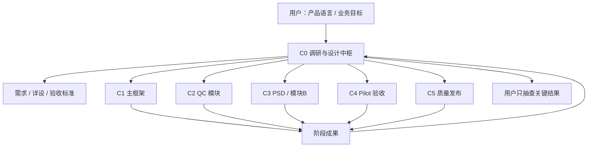

# QLanalyser Online 团队操作模型与 Clean Code 工程规则

更新时间：2026-06-19
状态：团队治理基线 / 多对话协作 / 开发到上线维护闭环

## 1. 已核实的当前团队状态

本文件基于本地 Codex 对话读取和仓库状态核实，不把未验证猜测当成事实。

当前已存在或已使用的对话：

| 对话 | 当前事实 | 建议定位 |
| --- | --- | --- |
| 脑电分析平台（调研与设计） | 用户主要与本对话沟通；负责调研、设计、拆任务、评审 | C0 架构 / 调研 / 设计中枢 |
| 脑电分析平台开发（主框架开发） | 最近在做 QC/PSD 共用 data_preparation_plan 服务 | C1 主框架与公共底座开发 |
| 脑电分析平台（模块开发1） | 最近在做 QC 数据准备工作台交互与 64 通道预览 | C2 模块开发 A：QC / 数据准备 |
| 脑电分析平台（模块开发2） | 目前基本空闲 | C3 模块开发 B：PSD 或下一个独立分析模块 |
| 脑电分析平台 设计开发 | 曾承担 Pilot 验收、入口/按钮流审计、GLM sidecar 规则 | C4 Pilot / 用户流程 / 验收回归 |

当前仓库状态提醒：本地 main 已领先 GitHub，且有其他对话留下的未提交前端/QC 改动。任何提交或 push 都必须精确暂存，不能使用 git add .。

## 2. 推荐团队规模

建议先扩到 6 个常驻对话，不要一开始拉满 10 个。

原因：6 个已经能覆盖设计、主框架、两个模块、验收、质量上线的闭环；继续增加对话会提高同步成本。等接口稳定、模块数量增加、上线压力真实出现后，再扩到 8 到 10 个。

## 3. 六对话常驻团队

| 编号 | 角色 | 核心职责 | 独立性要求 |
| --- | --- | --- | --- |
| C0 | 架构 / 调研 / 设计中枢 | 理解用户产品语言，做 EEG/MNE 调研，输出需求/详设，拆任务，最终一致性把关 | 必须独立；不能被单个模块实现牵住 |
| C1 | 主框架开发 | API、路由、状态、任务、artifact、登录/权限、部署底座 | 必须独立；保护全局契约 |
| C2 | 模块开发 A：QC | QC 公共数据准备、预览、坏导/坏段、plan 接入 | 与主框架通过契约协作，不私改全局结构 |
| C3 | 模块开发 B：PSD | PSD/频段功率等独立分析模块 | 与 QC 并行，复用 plan，不改 QC 内部 |
| C4 | Pilot / 验收 / 用户流程 | 主链路、按钮流、截图评审、客户体验、回归 | 必须和实现者分离，防止自证正确 |
| C5 | 质量 / 发布 / 维护 | Clean Code gate、测试策略、发布检查、回滚、技术债 | 有权阻止不满足门禁的交付 |

## 4. 后续扩到 8 到 10 个对话的条件

| 新角色 | 触发条件 | 负责内容 |
| --- | --- | --- |
| C6 UI / 交互专项 | UI 反复混乱、截图评审质量不足 | 业务流程页面、客户文案、信息层级、截图评审 |
| C7 测试自动化 / 科学验证 | 模块变多，手动验收拖慢 | synthetic EEG、MNE 对照、E2E、性能、报告复现 |
| C8 数据治理 / 权限 / 计费 | 登录、授权、付费、隐私、审计变复杂 | 权限模型、数据隔离、计费边界、合规文本 |
| C9 DevOps / 监控 / 运维 | 真正上线、有用户和故障处理需求 | 部署、日志、监控、备份、回滚、事故复盘 |

## 5. 用户与团队的信息流

用户以后可以只用产品或用户语言表达目标，例如：

“这个页面太乱，客户看不懂，我希望它围绕上传、检查、分析、出报告来走。”

C0 必须把它翻译成：

1. 产品目标。
2. 用户流程。
3. 页面、接口、模块边界。
4. 给 C1/C2/C3/C4/C5 的任务包。
5. 验收标准。
6. 风险和需要用户抽查的点。

## 6. Clean Code 核心思想在本项目中的规则

这里不是照搬书本，而是把核心工程思想变成可验收规则。

### 6.1 命名表达意图

- 名称必须说明业务含义或技术职责。
- 禁止大量使用 data、temp、handle、process 这类模糊名。
- 同一概念在 UI、API、文档中必须同名，例如 data_preparation_plan 不要又叫 preprocess profile、clean config、qc draft。

### 6.2 函数只做一件事

- 编排函数负责流程，不直接塞满解析、绘图、文件写入、错误展示。
- 校验、转换、绘图、IO、DOM 渲染应尽量拆开。
- 复杂函数必须有测试或清晰验收脚本覆盖。

### 6.3 模块边界清晰

- QC/PSD 等模块只能通过主框架提供的 API、task、artifact、plan 契约协作。
- 模块不得私自修改全局状态结构、登录/权限、公共路由。
- 主框架不得在没有详设的情况下修改科学算法行为。

### 6.4 控制重复

- 同类逻辑出现第三次，需要抽取公共函数或写明不抽取原因。
- 特别关注：参数校验、artifact 命名、任务状态、错误提示、客户文案。

### 6.5 副作用隔离

- 文件读写、网络请求、状态修改、artifact 注册应集中在 service/helper 层。
- UI 展示代码不要直接写持久状态。
- EEG 算法代码不要直接决定客户界面文案。

### 6.6 错误信息要有用

- 客户看到的错误要说明下一步怎么办。
- 日志可以更技术化，但不能泄露密钥、隐私或不必要的本地路径。
- 不允许空白页、静默失败、无解释 404。

### 6.7 测试随风险增长

- 小范围文案/UI：静态检查 + 浏览器检查。
- 共享 API：契约测试 + 冲突/错误分支测试。
- EEG 分析模块：合成数据已知答案 + MNE/reference 对照 + artifact 可复现。
- 发布前：端到端 Pilot smoke + 下载/报告检查 + 回滚方案。

## 7. 必要测试体系

| 层级 | 谁负责 | 必测内容 |
| --- | --- | --- |
| 单元/函数测试 | 模块开发 | 参数校验、纯转换、频段计算、坏段/坏导转换 |
| API/契约测试 | 主框架 + 质量 | plan 保存读取、revision 冲突、task 引用、artifact 下载 |
| 科学验证 | 模块开发 + C0 + 质量 | synthetic EEG、已知频率峰、MNE 对照、容差说明 |
| UI 流程测试 | Pilot 验收 + UI 专项 | 页面主路径、按钮目标、错误提示、截图评审 |
| E2E Pilot smoke | 验收 + 发布 | 上传或选择文件 -> QC -> plan -> PSD -> 结果 -> 报告下载 |
| 发布维护检查 | 质量/上线 | Git 状态、敏感信息、部署、回滚、技术债、日志 |

## 8. 每个对话的交付模板

所有执行对话完成阶段工作时必须返回：

### 阶段交付

- 任务目标：...
- 修改范围：...
- 未触碰范围：...
- 关键设计决定：...

### Clean Code Gate

- 命名：pass / fail / exception
- 函数职责：pass / fail / exception
- 边界：pass / fail / exception
- 重复：pass / fail / exception
- 副作用：pass / fail / exception
- 错误处理：pass / fail / exception

### 验证结果

- 命令/脚本：...
- 结果：...

### UI/客户可见变化

- ...

### 风险和未决问题

- ...

### Git 状态

- branch:
- ahead/behind:
- commit:
- push:

## 9. 新增或启用的项目 skills

团队协作时优先使用以下 repo-level skills：

- qlanalyser-team-orchestrator：把用户产品语言转为团队任务包。
- qlanalyser-clean-code-quality-gate：Clean Code 工程质量门禁。
- qlanalyser-ui-business-flow-review：客户界面业务流程与截图评审。
- qlanalyser-release-maintenance-gate：发布、测试、维护、回滚门禁。
- qlanalyser-github-baseline-sync：每次任务开始和结束都查 GitHub 基线。
- qlanalyser-git-guard：精确提交与 push 防护。

## 10. 当前建议的下一步

1. 让 C1 主框架完成并推送 data_preparation_plan 公共底座。
2. 让 C2 QC 模块等待公共 API 稳定后接入真实 plan 保存/读取。
3. 启动 C3 模块开发2，负责 PSD 模块 P0，不再空置。
4. 设立 C5 质量/发布对话，专门做 Clean Code gate、测试矩阵和上线门禁。
5. 对当前混乱 UI 先走 qlanalyser-ui-business-flow-review，不要继续让各模块自由发挥页面文案和布局。
