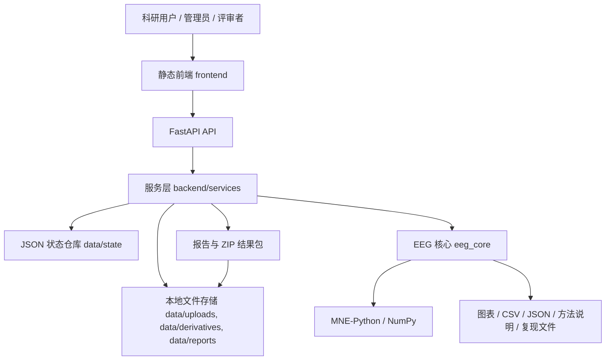
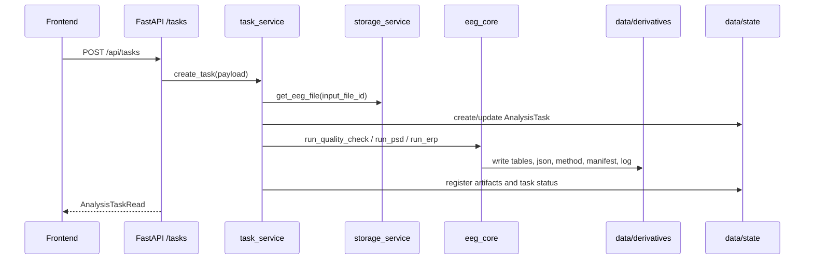
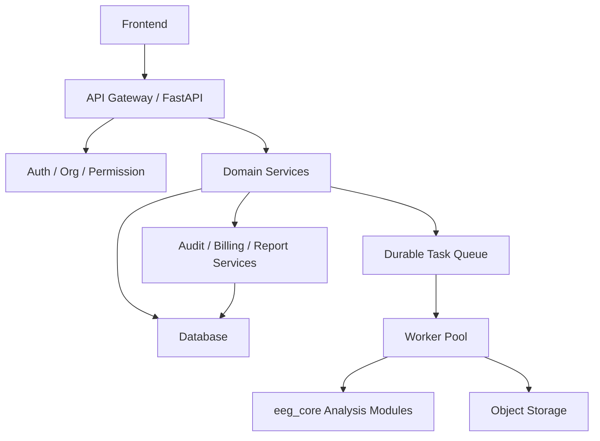

# QLanalyser Online 系统架构设计

更新时间：2026-06-18

## 1. 文档定位

本文件是 QLanalyser Online 的系统架构设计总纲，用于多个 AI 对话、开发任务和评审会议共享同一套架构依据。

开发依据优先级：

1. 本仓库 Markdown 文档。
2. 代码实际实现。
3. 飞书同步摘要。
4. 对话记忆。

如飞书或对话内容与本文件冲突，以仓库文档为准。

## 2. 产品定位与边界

QLanalyser Online 是面向科研团队的 EEG 数据管理、分析交付与复现记录平台。

当前 v0.1 Pilot 是稳定 MVP，用于客户免费试用和科研流程验证，不是完整商业化平台，也不是临床诊断系统。

明确不做：

- 临床诊断、疾病判读或医疗建议。
- HIS/PACS 集成。
- AI 自动解释结论。
- 复杂多租户权限。
- 正式支付扣费。
- 完整 BIDS 工作流。
- 可视化拖拽工作流编辑器。

## 3. 当前实际架构



当前运行形态：

```text
Browser static frontend
  -> FastAPI API
  -> service layer
  -> local JSON state store
  -> local filesystem uploads/derivatives/reports
  -> MNE-Python eeg_core analysis
```

适用场景：客户演示、内部验收、小样本 EEG 文件试用、单机部署、受控并发、输出契约和科研交付物打磨。

不适合场景：大规模多租户生产、正式账务、强审计、对象存储生产治理、横向扩容 worker 集群。

## 4. 分层职责

| 层级 | 当前主要文件 | 职责 | 不负责 |
| --- | --- | --- | --- |
| 前端入口 | `frontend/index.html`, `frontend/app.js`, `frontend/styles.css` | 登录/注册入口、客户工作台、管理员视图、真实分析流程面板 | 直接执行 EEG 分析 |
| 分析实验室 | `frontend/module-lab.*`, `frontend/research-modules.*`, `frontend/research-module/*.html` | 免登录模块孵化、静态评审、模块输入输出展示 | 正式鉴权、后端执行承诺 |
| API 路由 | `backend/api/*.py`, `backend/main.py` | 暴露 HTTP 接口，保持薄路由 | 复杂业务逻辑和 MNE 计算 |
| 服务层 | `backend/services/*.py` | 项目、文件、任务、报告、状态、就绪度和存储协调 | EEG 算法细节 |
| 状态层 | `backend/services/state_store.py`, `data/state/*.json` | 单机 JSON registry 持久化、并发写保护、状态恢复 | 生产级数据库能力 |
| 文件存储 | `data/uploads`, `data/derivatives`, `data/reports` | 原始文件、本地分析输出和报告包 | 对象存储、CDN、跨区域备份 |
| 分析核心 | `eeg_core/io`, `eeg_core/preprocess`, `eeg_core/analysis`, `eeg_core/report` | EEG 读取、QC、PSD、ERP、复现文件、报告内容 | FastAPI、用户 session、前端状态 |
| worker 包装 | `worker/tasks/*.py`, `worker/celery_app.py` | 为未来队列预留同形任务入口 | 当前不提供真实 Celery/Redis 队列 |
| 验收脚本 | `scripts/acceptance_*.py`, `scripts/*.mjs` | API、worker/core、持久化、UI、研究模块验收 | 替代正式监控系统 |

## 5. 核心领域对象

- Project：研究项目。
- Subject：受试者。
- EEGFile：上传的 EEG 文件和元数据。
- AnalysisTask：一次 QC / PSD / ERP 等分析任务。
- Artifact：分析任务产生的图、表、JSON、文本、ZIP 等文件。
- Report：HTML 报告和结果包。
- WorkflowTemplate：分析模板或推荐流程。
- Readiness：平台与模块就绪状态。
- Billing/Admin 原型对象：用于展示和未来设计，不代表正式支付扣费已上线。

## 6. API 架构

当前 API 通过 `backend/main.py` 注册以下路由组：

| 路由组 | 文件 | 说明 |
| --- | --- | --- |
| health | `backend/api/health.py` | 健康检查和 readiness |
| projects | `backend/api/projects.py` | 项目创建与查询 |
| subjects | `backend/api/subjects.py` | 项目下受试者管理 |
| eeg-files | `backend/api/eeg_files.py` | 上传 EEG、查询文件和 metadata |
| templates | `backend/api/templates.py` | 分析模板、范式和推荐规则 |
| tasks | `backend/api/tasks.py` | 创建任务、查询任务和任务产物 |
| artifacts | `backend/api/artifacts.py` | artifact 下载 |
| reports | `backend/api/reports.py` | 报告创建和结果包下载 |
| billing | `backend/api/billing.py` | 计费原型 / 边界展示 |
| data-crud | `backend/api/data_crud.py` | 数据 CRUD 原型 |
| workflow | `backend/api/workflow.py` | workflow 描述和预留入口 |
| admin | `backend/api/admin.py` | 管理员 dashboard 与失败任务视图 |

API 设计规则：

- API route 保持薄层。
- 业务协调放在 `backend/services`。
- EEG 算法放在 `eeg_core`。
- 长任务语义通过 task 模型表达，即使 v0.1 当前仍为同步执行。

## 7. 任务执行与输出契约



v0.1 当前没有真实后台队列；`task_service.create_task()` 会在 API 调用链路中执行 QC / PSD / ERP，并写出状态和 artifact。

QC / PSD / ERP 当前输出目录应保持：

```text
data/derivatives/{project_id}/{task_id}/
  result.json
  manifest.json
  log.txt
  tables/*.csv
  figures/*
  reproducibility/
    parameters.json
    software_versions.json
    workflow.json
    method_description.txt
    *_summary.json
```

核心契约版本：`qlanalyser-output-v0.1`。

## 8. 报告与交付包架构

报告服务负责把任务输出汇总为 HTML 报告和 ZIP 结果包。

```text
report_package.zip
  reports/report.html
  tables/*.csv
  figures/*
  reproducibility/parameters.json
  reproducibility/software_versions.json
  reproducibility/workflow.json
  reproducibility/method_description.txt
  result.json
  manifest.json
  log.txt
```

报告必须保留科研用途边界，不输出临床诊断、疾病判断或自动医学解释。

## 9. 分析实验室架构

分析实验室是正式功能的孵化区，不是临时页面。

当前入口：

- `frontend/module-lab.html`
- `frontend/module-lab.html?module=qc`
- `frontend/module-lab.html?module=psd`
- `frontend/module-lab.html?module=erp`
- `frontend/module-lab.html?module=tfr`
- `frontend/module-lab.html?module=pac`
- `frontend/module-lab.html?module=connectivity`
- `frontend/research-modules.html`

规则：

- 实验室免登录。
- 正式工作台保留登录 / 注册。
- 实验室只展示静态样例、设计证据、合成数据和评审材料。
- 通过验收后，模块再服务化 / 模块化 / 合并进入正式主流程。
- TFR / PAC / Connectivity 在 v0.1 只允许标记为 preview，不得宣传为后端可用 stable 功能。

## 10. 存储与状态设计

当前单机存储：

```text
data/uploads/       原始上传 EEG 文件
data/derivatives/   分析输出、图表、表格、复现文件
data/reports/       HTML 报告与 ZIP 结果包
data/state/         JSON registry 状态
```

设计原则：

- 原始 EEG 文件不提交 Git。
- Git 只提交代码、文档、合成样例和可公开的静态资产。
- v0.1 使用本地 JSON state store；v0.2+ 迁移到数据库前，API 模型和服务边界应保持稳定。
- v1 生产环境应引入对象存储、数据库、审计日志和下载授权。

## 11. 安全、合规与科研边界

- 不提交真实客户 EEG 数据、邮箱、充值记录、日志或隐私信息。
- 不把分析结果作为临床诊断依据。
- 下载、删除、管理员操作未来必须审计。
- 多租户隔离、正式权限和计费在 v0.1 不承诺生产可用。
- 高级分析需要统计与伪迹控制审查后才能启用。

## 12. 测试与验收体系

| 范围 | 脚本 |
| --- | --- |
| API smoke | `scripts/smoke_v01_api.py` |
| worker/core | `scripts/acceptance_v01_worker_core.py` |
| 持久化 | `scripts/acceptance_v01_persistence.py` |
| 全 API | `scripts/acceptance_v01_full.py` |
| UI | `scripts/acceptance_v01_ui.mjs` |
| 研究模块静态页 | `scripts/acceptance_research_modules_static.mjs` |
| 文本编码 | `scripts/check_no_mojibake.py` |
| 并发状态 | `scripts/acceptance_state_store_concurrency.py` |
| 虚拟用户 | `scripts/launch_v01_virtual_users.py`, `scripts/launch_v01_public_virtual_users.py` |

每次架构或模块契约变更至少应运行：

```powershell
python scripts\check_no_mojibake.py
git diff --check
```

代码实现变更再按影响范围运行 API / worker / UI / research-module 验收。

## 13. 目标演进架构



v0.1 不直接引入这些组件，但当前服务边界、输出契约和 worker wrapper 必须为后续迁移预留空间。

## 14. 当前架构风险

| 风险 | 当前处理 | 后续版本动作 |
| --- | --- | --- |
| API 同步执行分析 | v0.1 仅用于受控 Pilot | v0.2 引入 runner adapter，v1 引入队列 |
| JSON state store 非正式数据库 | 已做本地并发加固 | v0.2 设计数据库迁移，v1 上线数据库 |
| 大文件上传能力有限 | 当前本地上传和单机存储 | v0.2 做容量摸底，v1 对象存储/分片/直传 |
| 计费/权限只是原型 | readiness 中如实标记边界 | v1 设计正式账务和权限服务 |
| 高级分析易误用 | v0.1 disabled/preview | 科研审查和验收后再开放 |

## 15. 开发协作规则

- 新对话必须先读 `docs/AI_CONVERSATION_SYNC.md` 与 `docs/AI_HANDOFF_CURRENT.md`。
- 架构变化先更新本文件或 `docs/architecture/version_detailed_design.md`。
- 模块设计变化先更新 `docs/modules/analysis_modules_design_matrix.md` 或对应模块设计文档。
- 重要产品/架构决策同步到 `docs/DECISIONS.md`。
- 飞书只同步摘要，不作为唯一开发依据。
