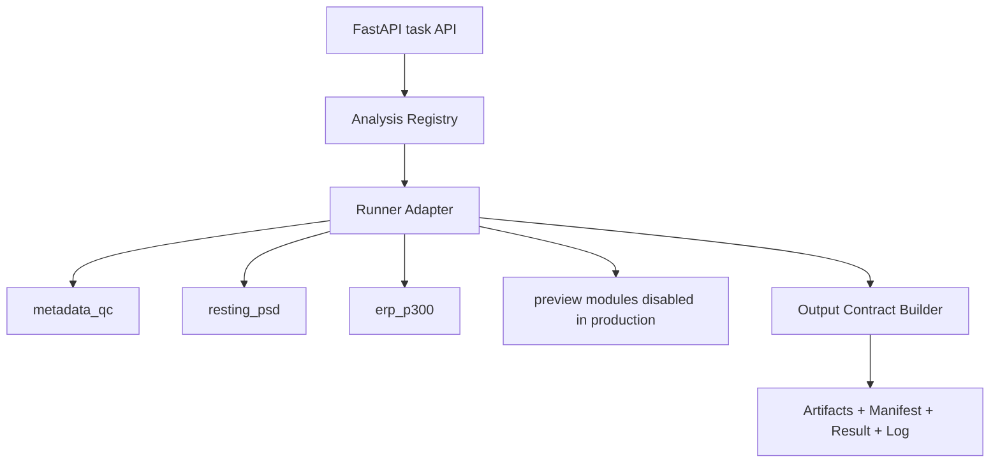
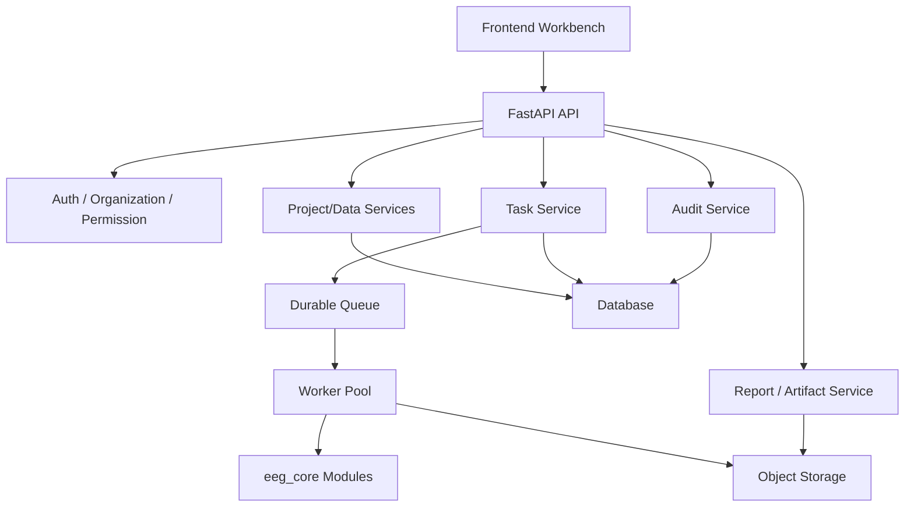

# QLanalyser Online 各版本详细设计

更新时间：2026-06-18

## 1. 文档定位

本文件梳理 QLanalyser Online 从当前 Pilot 到后续生产化版本的版本边界、详细功能、架构演进和验收标准。

版本文档用于回答：

- 当前版本到底承诺什么。
- 哪些能力只是实验室 preview。
- 哪些能力进入下一版本。
- 多个开发对话应该按什么边界开发。

## 2. 版本总览

| 版本 | 定位 | 状态 | 核心目标 | 不承诺 |
| --- | --- | --- | --- | --- |
| Legacy Static MVP | 静态业务原型 | 历史参考 | 展示客户/管理员/报告闭环 | 真实后端、真实分析、生产架构 |
| v0.1 Pilot | 单机可试用科研分析 MVP | 当前主线 | 上传、metadata/QC、PSD、ERP、报告包、实验室孵化 | 正式支付、多租户、队列、对象存储、临床诊断 |
| v0.2 Module & Service Hardening | 模块化和服务边界加固 | 下一阶段 | 统一 runner/output contract、队列适配层、模块文档和容量摸底 | 大规模商业化 SLA |
| v0.3 Public Beta | 小范围公测 | 规划 | 客户试用闭环、权限雏形、反馈与运营看板 | 完整商业计费和强合规 |
| v1.0 Research Platform | 正式科研平台 | 目标 | 数据库、对象存储、任务队列、组织权限、报告交付 | 医疗诊断、HIS/PACS、AI 医嘱 |
| v1.x Commercial/Scale | 商业化扩展 | 远期 | 正式计费、审计、SLA、更多分析模块 | 未经验证的高级分析自动结论 |

## 3. Legacy Static MVP 详细设计

### 3.1 定位

历史静态 MVP 用于验证产品叙事、页面结构、客户工作台、管理员后台和报告交付展示。

### 3.2 主要能力

- 登录页和客户工作台静态演示。
- 管理员后台静态演示。
- 充值、订单、报告、数据管理等业务概念展示。
- 使用合成或示例资产展示图表和报告。

### 3.3 架构

```text
Static HTML/CSS/JS
  -> local assets
  -> no real API requirement
```

### 3.4 验收标准

- 页面可访问。
- 客户和管理员导航可点击。
- 文案不出现旧品牌和临床诊断承诺。
- 不暴露内部测试、真实客户数据或敏感信息。

### 3.5 后续处理

- 只作为历史参考和视觉素材来源。
- 不作为当前开发主线。
- 能复用的页面思路应迁移到 `frontend/` 当前主线，而不是继续扩展 `outputs/` 历史目录。

## 4. v0.1 Pilot 详细设计

### 4.1 定位

v0.1 Pilot 是当前主线版本：稳定、保守、可演示、可小范围试用的单机科研 EEG 分析 MVP。

### 4.2 用户目标

科研用户可以：

1. 创建项目。
2. 上传 EEG 文件。
3. 查看 metadata 和质量信息。
4. 运行 QC / PSD / ERP。
5. 查看任务状态和 artifact。
6. 生成 HTML 报告和 ZIP 结果包。
7. 下载可复核结果。

评审者可以：

1. 免登录访问分析实验室。
2. 查看 QC / PSD / ERP / TFR / PAC / Connectivity 的模块设计。
3. 审核输入、参数、MNE 方法、输出、图表、风险和证据包。

管理员可以：

1. 查看任务、失败原因、系统状态等原型信息。
2. 了解正式运营后台未来边界。

### 4.3 当前架构

```text
frontend static app
  -> FastAPI backend
  -> backend/services
  -> data/state JSON registry
  -> data/uploads / derivatives / reports
  -> eeg_core MNE-Python analysis
```

### 4.4 v0.1 必须稳定的模块

| 模块 | job_type / template | 稳定度 | 输入 | 输出 |
| --- | --- | --- | --- | --- |
| QC | `metadata_qc` | 必须稳定 | EDF/BDF/FIF/BrainVision/SET/CNT 等 EEG 文件 | `qc_summary.json`, `parameters.json`, `software_versions.json`, `workflow.json`, `result.json`, `manifest.json`, `log.txt` |
| PSD | `resting_psd` | 必须稳定 | 可读 EEG 文件、至少一个 EEG 通道、PSD 参数 | `band_power.csv`, `channel_band_power.csv`, `psd_summary.json`, 方法说明、统一契约文件 |
| ERP | `erp_p300` | 有事件时启用 | 可读 EEG 文件、annotations/events、epoch 参数 | `erp_metrics.csv`, `erp_summary.json`, 方法说明、统一契约文件 |

### 4.5 v0.1 preview 模块

| 模块 | 状态 | 要求 |
| --- | --- | --- |
| TFR / ERSP / ITC | preview only | 只展示设计、参数和风险；后端不承诺 stable 执行 |
| PAC / CFC | preview only | 必须说明 surrogate/null model、滤波边界和假阳性风险 |
| Connectivity | preview only | 必须说明参考、体积传导、metric 和统计控制风险 |

### 4.6 输出契约

v0.1 输出目录应保持：

```text
data/derivatives/{project_id}/{task_id}/
  result.json
  manifest.json
  log.txt
  tables/*.csv
  reproducibility/
    parameters.json
    software_versions.json
    workflow.json
    method_description.txt
    *_summary.json
```

报告包应包含：

```text
reports/report.html
tables/*.csv
figures/*
reproducibility/*
result.json
manifest.json
log.txt
```

### 4.7 v0.1 验收

必须通过：

- `python scripts\smoke_v01_api.py`
- `python scripts\acceptance_v01_worker_core.py`
- `python scripts\acceptance_v01_persistence.py`
- `python scripts\acceptance_v01_full.py`
- `node scripts\acceptance_research_modules_static.mjs`
- `python scripts\check_no_mojibake.py`

UI 验收需先启动 backend/frontend 后运行：

- `node scripts\acceptance_v01_ui.mjs`

### 4.8 v0.1 明确不做

- 正式 Celery/Redis 队列。
- PostgreSQL / MySQL 生产数据库。
- 对象存储直传。
- 正式支付、充值、发票闭环。
- 多组织权限隔离。
- 临床报告。
- 高级分析 stable 承诺。

## 5. v0.2 Module & Service Hardening 详细设计

### 5.1 定位

v0.2 是从 Pilot 走向可维护服务架构的加固版本。重点不是扩展大量新功能，而是让现有 QC / PSD / ERP 具备稳定模块边界、统一 runner、可迁移任务系统和更可靠输出契约。

### 5.2 目标

1. 建立统一分析模块 registry。
2. 建立 runner adapter，让 API 同步执行和未来 worker 队列走同一入口。
3. 统一所有任务状态语义。
4. 完成输出契约稳定化和 schema 验收。
5. 建立模块级文档和模块级测试。
6. 做上传容量和并发摸底。

### 5.3 目标架构



### 5.4 详细任务

| 方向 | 设计要求 | 验收 |
| --- | --- | --- |
| 模块 registry | `job_type -> runner` 映射稳定，禁止 route 直接判断复杂算法细节 | 单元测试覆盖未知 job_type 和 disabled job_type |
| runner adapter | 同一 runner 可被 API 和 worker wrapper 调用 | QC/PSD/ERP API 与 worker 输出一致 |
| 任务状态 | `created -> queued -> running -> completed/failed/cancelled` | 失败任务保留 error_code/error_message |
| 输出契约 | 所有模块有 `result.json`, `manifest.json`, `log.txt` | contract schema 检查通过 |
| 模块文档 | QC/PSD/ERP 每个模块有 `docs/modules/*.md` | 文档包含输入、参数、MNE 对应、输出、风险 |
| 容量摸底 | 记录大文件 metadata/PSD 耗时和内存 | 形成容量报告，不承诺生产 SLA |

### 5.5 v0.2 不做

- 不一次性替换全部状态层为数据库。
- 不直接引入正式支付。
- 不把 TFR/PAC/Connectivity 宣传为 stable。
- 不重写全部前端。

## 6. v0.3 Public Beta 详细设计

### 6.1 定位

v0.3 面向小范围公测，目标是让真实科研用户在受控范围内使用平台，并把反馈转化为模块改进和正式平台需求。

### 6.2 目标能力

- 公测用户入口与说明。
- 项目/数据/任务/报告的完整试用闭环。
- 试用反馈收集。
- 管理员可查看失败任务、使用量和用户问题。
- 基础组织/用户边界雏形。
- 模块公测准入规则。

### 6.3 公测模块准入

一个模块进入公测前必须满足：

1. 实验室页面完整。
2. 输入/参数/输出/风险文档完整。
3. 后端 runner 输出契约稳定。
4. 至少有合成数据和一个真实公开样例验证。
5. 失败状态可读。
6. 报告包可复核。
7. 不输出临床结论。

### 6.4 反馈闭环

```text
用户试用
  -> 反馈表 / 管理员记录
  -> TASK_LOG / issue / docs 更新
  -> 模块设计修订
  -> 回归验收
  -> 下一轮公测
```

### 6.5 v0.3 不做

- 不开放未验证高级分析给普通用户。
- 不承诺正式 SLA。
- 不把原型计费当真实扣费系统。

## 7. v1.0 Research Platform 详细设计

### 7.1 定位

v1.0 是正式科研平台版本，面向小团队、课题组和科研服务交付，具备生产可维护性、基础权限、任务队列和稳定报告交付。

### 7.2 目标架构



### 7.3 目标能力

| 能力 | 设计要求 |
| --- | --- |
| 账户与组织 | 用户、组织、项目访问边界明确 |
| 数据管理 | 原始文件对象存储，metadata 入库，删除/下载有审计 |
| 任务队列 | API enqueue，worker 异步执行，失败可重试 |
| 分析模块 | QC/PSD/ERP stable，TFR beta 可控，PAC/Connectivity 仍需审查 |
| 报告交付 | HTML + ZIP + manifest + reproducibility 完整 |
| 管理后台 | 用户、任务、失败、存储、worker 状态可查看 |
| 安全合规 | 不临床诊断，敏感信息不出库，下载授权可追踪 |

### 7.4 v1.0 验收

- 登录和组织隔离可验证。
- 数据只能被所属组织访问。
- 任务队列断点和失败恢复可验证。
- 结果包完整性可验证。
- 管理员可追踪任务和失败原因。
- 公测反馈中的高优先级问题已关闭。

## 8. v1.x Commercial / Scale 详细设计

### 8.1 定位

v1.x 是商业化和规模化阶段，重点是支付、审计、SLA、批量服务、私有化部署和更多科研分析模块。

### 8.2 目标能力

- 正式充值、订单、扣费、发票和账务流水。
- 存储配额和分析计费策略。
- 批量任务与队列优先级。
- 客户级 SLA 和监控告警。
- 私有化部署包。
- 更完整的 EEGLAB/BIDS 兼容。
- 组水平统计和多被试报告。

### 8.3 高级分析启用规则

TFR / PAC / Connectivity 等高级模块进入 stable 前必须完成：

- 统计单位和多重比较策略。
- surrogate/null model 或 permutation 方案。
- 伪迹、参考方式、体积传导等风险控制。
- 受试者级表格与 group-level 统计边界。
- 公开样例和真实场景验收。
- 图表和方法说明达到投稿可复核标准。

## 9. 版本间迁移原则

1. 先稳定 QC / PSD / ERP，再扩展高级模块。
2. 先固化输出契约，再迁移任务队列和数据库。
3. 实验室先行，验收后再进入正式工作台。
4. 任何新能力必须明确 stable / beta / preview 状态。
5. 不用营销文案掩盖架构边界。
6. 所有版本都保留科研用途和非临床诊断边界。

## 10. 当前下一步建议

1. 为 QC / PSD / ERP 分别补独立模块详细设计文档。
2. 为统一 runner registry 写实现方案和最小 adapter。
3. 为 v0.2 容量摸底定义测试数据、指标和验收记录格式。
