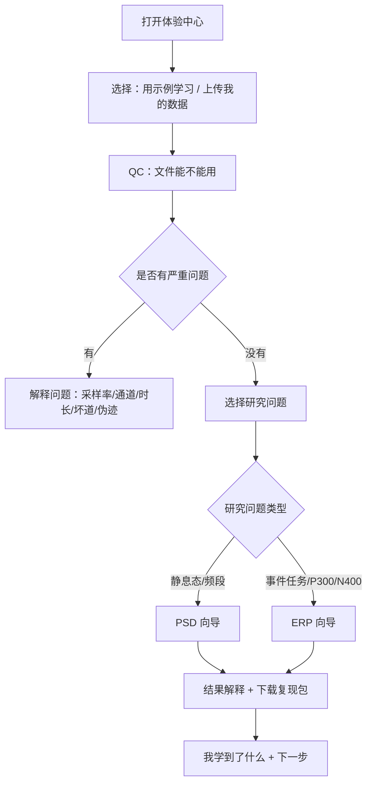

# 新手学习式脑电分析体验设计

更新时间：2026-06-18

## 1. 目标

QLanalyser Online 的分析模块不能只服务熟悉 MNE / EEG 的专家。目标用户包括“脑电分析小白”：知道自己有 EEG 数据和研究问题，但不清楚 QC、PSD、ERP、baseline、event_id、reject、topomap、统计单位这些概念。

本设计目标：

1. 用户能按软件引导完成一次可靠的 QC / PSD / ERP。
2. 用户在使用过程中自然理解关键概念，而不是先读长教程。
3. 每个结果都有可追溯的参数、方法说明、输出文件和风险提示。
4. 产品不自动宣称“顶刊水准”，而是把证据链做到接近严肃发表所需：可复核、可复现、可解释、不过度解释。

## 2. 产品原则

### 2.1 先完成，再理解，再进阶

新手路径分三层：

1. **一键示例**：先用系统内置合成 EDF 跑一遍，让用户看到完整结果。
2. **带解释运行**：用户上传自己的文件，系统逐步解释每个选择。
3. **专家参数**：用户理解后再开放高级参数和方法分支。

默认界面不应该先暴露完整参数表。每一步只问当前必要问题，并在结果旁边解释“为什么”。

### 2.2 每个模块都要回答四句话

| 问题 | 用户语言 |
| --- | --- |
| 我现在要做什么？ | 先检查数据能不能用 / 看频段能量 / 看事件相关反应。 |
| 为什么要做这一步？ | 避免坏数据、错误事件或错误参数让结果失真。 |
| 系统发现了什么？ | 文件可读、alpha 明显、target P300 更大等。 |
| 我下一步该做什么？ | 继续 PSD / 确认事件码 / 调整参数 / 请专家复核。 |

### 2.3 结果要“可发表地诚实”

顶刊水准不是漂亮图，而是：

- 数据来源清楚。
- QC 通过且异常可解释。
- 参数透明。
- 统计单位正确，subject 不是 trial。
- 图表有单位、时间窗、频段、样本量和方法说明。
- 所有自动解释都有边界提示。
- 失败时不糊弄用户，明确告诉用户为什么不能继续。

## 3. 新手主流程



## 4. 模块学习设计

### 4.1 QC：先判断数据能不能用

新手解释：

- “QC 就像体检。不是分析结论，而是告诉你这份 EEG 是否值得继续。”

界面应按以下顺序展示：

1. 文件是否能打开。
2. 采样率是否足够。
3. 时长是否足够。
4. EEG 通道是否存在。
5. 是否有平线或极端振幅通道。
6. 是否有事件标记，供 ERP 使用。

每项都给出：

- 结果：通过 / 需注意 / 阻断。
- 白话解释。
- 对下一步的影响。

### 4.2 PSD：看频段能量

新手解释：

- “PSD 是看不同频率里有多少能量。静息态里常先看 alpha、theta、beta 等频段。”

默认只问：

1. 频率范围：默认 1-40 Hz。
2. 是否使用默认频段：delta/theta/alpha/beta/low gamma。
3. 是否需要按通道导出。

结果旁边必须解释：

- alpha 高不等于某种诊断。
- 绝对功率受参考、阻抗、伪迹影响。
- 组间比较前要保证预处理一致。

### 4.3 ERP：看事件相关反应

新手解释：

- “ERP 是把很多次刺激对齐到同一个时间点，看刺激后大脑反应的平均波形。”

ERP 向导必须先确认事件：

1. 系统发现哪些事件名称和事件码。
2. 用户选择哪个是 target，哪个是 standard。
3. 系统解释 epoch：例如从刺激前 200 ms 到刺激后 800 ms。
4. 系统解释 baseline：用刺激前一小段作为零点。
5. 系统显示每个条件剩多少 epoch。

ERP 结果必须避免直接给“认知能力”等解释，只能说：

- 在当前参数下，target 条件在 P300 时间窗的幅值高于/低于 standard。
- 这需要结合范式、事件码、trial 数、通道/ROI 和统计设计解释。

## 5. 示例 EDF 验证记录

为验证“新手能用、结果能解释”，本轮新增脚本：

- `scripts/generate_teaching_oddball_case.py`

脚本会生成本地教学数据，不提交数据文件：

- EDF：`work/learning_case/data/teaching_oddball.edf`
- FIF：`work/learning_case/data/teaching_oddball_raw.fif`
- 输出：`work/learning_case/outputs/`
- 摘要：`work/learning_case/teaching_oddball_run_summary.json`

数据设计：

| 项目 | 值 |
| --- | --- |
| 时长 | 60 秒 |
| 采样率 | 250 Hz |
| 通道 | Fz, Cz, Pz, Oz, P3, P4, O1, O2 |
| 事件 | standard 24 个，target 12 个 |
| 频谱特征 | 后部 10 Hz alpha 较强 |
| ERP 特征 | target 注入更强 P300-like 响应 |

运行命令：

```powershell
python scripts\generate_teaching_oddball_case.py
```

### 5.1 QC 示例结果

QC 通过：

- 文件存在且可读。
- 格式 EDF，读取器 `mne.io.read_raw_edf`。
- 采样率 250 Hz。
- 时长 60 秒。
- EEG 通道 8 个。
- 平线通道 0 个。
- 极端振幅通道 0 个。

新手解释：这份示例数据可以继续做 PSD 和 ERP。

### 5.2 PSD 示例结果

`tables/band_power.csv` 关键结果：

| band | mean_psd |
| --- | --- |
| delta | 1.38e-13 |
| theta | 2.90e-13 |
| alpha | 5.04e-12 |
| beta | 2.27e-14 |
| gamma_low | 3.85e-15 |

解释：alpha 频段最高，符合示例数据中注入的后部 10 Hz alpha 节律。

新手界面应显示：

- “你看到 alpha 更高，是因为这个示例包含明显 10 Hz 节律。”
- “真实数据中 alpha 高低需要结合睁闭眼、参考方式、伪迹和统计设计解释。”

### 5.3 ERP 示例结果与重要风险发现

使用教学参数 `reference=None`，P300 结果：

| condition | P300 amplitude_uv | latency_ms | n_epochs |
| --- | --- | --- | --- |
| standard | 3.39 | 336 | 24 |
| target | 6.68 | 336 | 12 |

解释：target P300 高于 standard，符合示例数据设计。

但是，使用当前 ERP runner 默认 `reference="average"` 且随后做“所有 EEG 通道平均”时，P300 接近 0：

| condition | P300 amplitude_uv |
| --- | --- |
| standard | 约 0 |
| target | 约 0 |

这是一个重要可靠性发现：平均参考后再对所有通道求平均，可能抵消空间分布明确的 ERP 成分。ERP 模块进入高可信交付前，必须改为 ROI-aware 指标，例如 Pz/P3/P4 或用户选择 ROI，并在报告中记录参考方式。

## 6. 可靠性改造要求

### P0 必须补

1. ERP 指标必须支持 ROI，不应默认所有 EEG 通道平均。
2. ERP 报告必须展示 event_id 映射确认。
3. ERP 输出必须增加 drop log / rejected epoch 摘要。
4. PSD 必须增加显式参数校验和用户可读错误。
5. QC 结果必须给出“是否允许继续 PSD/ERP”的白话建议。

### P1 应补

1. 内置“示例数据学习模式”：用户不上传文件也能看完整 QC/PSD/ERP。
2. 每个结果旁边放“我该怎么看”说明。
