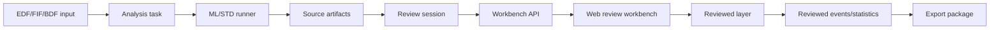

# 癫痫源码工作台复刻详细设计

状态：生产级详细设计草案，供 07 主干集成使用
日期：2026-06-27
源系统：`D:/Quanlan/Codes/Python/AR_analyser1/AR_analyser_PC`
目标系统：`D:/Quanlan/Codes/Python/quanlan-analyser-official`

## 0. P0 设计门槛

本设计的 P0 门槛：离散 Stage_Code 状态条、一屏联动 EEG/EMG/ACC/频谱、窗口化波形 API、review session 可保存重开、Undo/Redo/Reset action stack、性能不卡顿、非医疗边界、不改 router/Headroom/IPC。任何实现缺少其中一项，都不能进入生产级验收。

## 1. 设计目标

把 AR_analyser1 桌面端癫痫分析工作台迁移为 07 主干 Web 工作台，并保持源码交互语义：

- epoch-level 离散状态；
- 一屏联动波形复核；
- 快速事件/epoch 跳转；
- 人工矫正和可追溯审计；
- 大文件不卡顿；
- 非医疗科研筛查定位。

该设计不改变 ML 算法高保真迁移合同，不修改 router、Headroom、IPC、gateway。

## 2. 总体架构



核心拆分：

1. Analysis task：保留原始模型/算法输出。
2. Review session：保存 reviewed layer、action stack、UI 状态和导出元数据。
3. Windowed waveform API：按时间窗返回波形和 overlay。
4. Frontend workbench：只绘制当前窗口和聚合状态，不吃全量原始波形。

## 3. 源码到 Web 的组件映射

| 源码对象/交互 | Web 设计组件 | 说明 |
| --- | --- | --- |
| TopWidget | WorkbenchTopBar | 分析名称、Number of Epochs、分页导航 |
| BottomLeftWidget | ParameterSidebar | 文件、通道、epoch length、起止时间 |
| progressBar_widget | AnalysisProgressPanel | 异步任务状态 |
| widget_hypnogram + hlines | EpochStateStripCanvas | 离散状态条，不能用连续折线主图 |
| plot_eeg | EegWavePane | windowed EEG 曲线 |
| plot_emg | EmgEnvelopePane | windowed EMG envelope |
| plot_acc | AccWavePane | windowed ACC 曲线 |
| plot_widget | SpectrogramPane | windowed/tiled spectrogram |
| TimeSliderWidget | TimeWindowNavigator | 时间窗与页码联动 |
| Seizure/Normal buttons | StageEditToolbar | 修改 reviewed Stage_Code |
| Undo/Redo/Reset | ReviewActionStack | action stack |
| Save picture/data | ExportPanel | 图片、CSV、manifest、actions |
| Load history | ReviewSessionLoader | 恢复 reviewed session |

## 4. 前端详细设计

### 4.1 页面结构

生产模式页面结构：

```text
EpilepsyWorkbench
  WorkbenchTopBar
  WorkbenchBody
    ParameterSidebar
    ReviewCanvas
      StageEditToolbar
      EpochStateStrip
      SignalPaneStack
        EegWavePane
        EmgEnvelopePane
        AccWavePane
        SpectrogramPane
      TimeWindowNavigator
    EventInspector
    ExportPanel
```

说明：

- hero/说明区只在空状态或实验室入口页显示；
- 分析完成后默认进入 ReviewCanvas；
- EventInspector 可以在右侧或底部，但不能替代主画布；
- ExportPanel 不应占据首屏核心位置。

### 4.2 状态管理

建议状态分层：

```ts
type EpilepsyWorkbenchState = {
  task: AnalysisTask | null;
  session: ReviewSession | null;
  sourceEpochs: EpochSummary[];
  reviewedEpochs: EpochSummary[];
  events: ReviewedEvent[];
  selectedEpoch: number;
  selectedRange: { start: number; end: number };
  selectedEventId: string | null;
  timeWindow: { startSec: number; durationSec: number };
  waveformCache: WindowCache;
  actionStack: ReviewAction[];
  redoStack: ReviewAction[];
  ui: WorkbenchUiState;
};
```

原则：

- sourceEpochs 不可变；
- reviewedEpochs 由 sourceEpochs + overrides 派生；
- events 由 reviewedEpochs 派生；
- hover 状态不触发全量派生；
- 波形数据与 epoch summary 分开缓存。

### 4.3 EpochStateStrip

实现建议：

- 小窗口模式：可用 SVG/canvas/轻量 DOM；
- All 模式：必须用 canvas 聚合绘制，不用每 epoch 一个 button；
- 支持选中范围、当前 epoch、事件区间、人工修改 overlay；
- 交互命中测试由坐标换算 epoch index；
- probability/RMS 只在 tooltip 或 secondary track 显示。

渲染数据：

```json
{
  "epoch_index": 10,
  "start_sec": 50.0,
  "end_sec": 55.0,
  "source_stage_code": 0,
  "review_stage_code": 1,
  "probability_seizure": 0.83,
  "event_id": "evt_001",
  "manual_override": true
}
```

### 4.4 SignalPaneStack

每个波形面板只关心当前时间窗。

接口输入：

```ts
type SignalWindow = {
  startSec: number;
  durationSec: number;
  channels: string[];
  targetPointsPerChannel: number;
  includeFilteredPreview: boolean;
};
```

绘图方案优先级：

1. uPlot、Canvas 2D 或 WebGL 轻量绘图；
2. SVG 仅用于小窗口或 overlay；
3. 禁止用 img 作为主交互视图；
4. 大窗口必须使用 min/max decimation 或 LTTB/等价抽稀。

### 4.5 振幅控制

`Amplitude setting` 对应每个 pane 的 yRange：

- EEG：Auto、±100、±200、±500、±1000、±2000 uV；
- EMG：Auto、0-50、0-100、0-200、0-500 uV；
- ACC：Auto、±500、±1000、±2000、±4000 mG。

要求：

- 控件改变后只重绘对应 pane；
- 不重新请求无关数据；
- Auto 基于当前窗口数据计算；
- 设置写入 session UI state。

### 4.6 选择、跳转和窗口联动

事件流：

```text
click event row
  -> set selectedEvent
  -> compute timeWindow around event
  -> update selectedRange
  -> request waveform window if cache miss
  -> redraw strip and panes
```

```text
click epoch
  -> selectedEpoch = hit epoch
  -> selectedRange = single epoch
  -> ensure epoch visible
  -> update timeWindow if outside current window
```

```text
apply Seizure/Normal
  -> create ReviewAction
  -> update overrides
  -> recompute reviewed events
  -> update strip/event table
  -> keep waveform cache
```

### 4.7 避免整页重绘

当前 Web 的整页 `render()` 模式在数据量大、hover 多、波形交互频繁时有卡顿风险。建议拆分：

- 顶层只处理 layout；
- strip、wave panes、event table 独立更新；
- hover 只更新 overlay layer；
- waveform data 更新不重建参数表；
- action stack 更新只刷新相关按钮和 strip。

如果短期仍使用 vanilla JS：

- 拆出 `renderShell()`、`renderEpochStrip()`、`renderSignalPanes()`、`renderEventTable()`；
- 对 hover 和 mousemove 使用 requestAnimationFrame；
- 对 resize、wheel、slider 使用 debounce/throttle；
- 使用 DocumentFragment 或 canvas 避免大量 DOM churn。

## 5. 后端/API 详细设计

### 5.1 Review session API

建议新增或收敛到以下 API：

```text
POST /api/epilepsy/review-sessions/from-task/{task_id}
GET  /api/epilepsy/review-sessions/{session_id}
GET  /api/epilepsy/review-sessions/{session_id}/epochs
GET  /api/epilepsy/review-sessions/{session_id}/events
GET  /api/epilepsy/review-sessions/{session_id}/waveform
PATCH /api/epilepsy/review-sessions/{session_id}/epochs
POST /api/epilepsy/review-sessions/{session_id}/undo
POST /api/epilepsy/review-sessions/{session_id}/redo
POST /api/epilepsy/review-sessions/{session_id}/reset
POST /api/epilepsy/review-sessions/{session_id}/save
POST /api/epilepsy/review-sessions/{session_id}/export
```

### 5.2 Waveform window API

Request：

```text
GET /api/epilepsy/review-sessions/{session_id}/waveform?start_sec=120&duration_sec=60&channels=EEG3,EEG1,ACC0&target_points=1800&filtered=1
```

Response：

```json
{
  "session_id": "eprev_xxx",
  "start_sec": 120.0,
  "duration_sec": 60.0,
  "sfreq": 500.0,
  "decimation": {
    "method": "min_max",
    "target_points": 1800
  },
  "channels": [
    {
      "name": "EEG3",
      "kind": "eeg",
      "unit": "uV",
      "times_sec": [120.0, 120.01],
      "values": [1.2, 1.3],
      "min_values": null,
      "max_values": null
    }
  ],
  "epoch_overlays": [],
  "event_overlays": [],
  "cache": {"hit": true}
}
```

要求：

- API 返回窗口数据，不返回全量文件；
- 支持 decimation；
- 支持 raw 和 filtered preview；
- 支持 epoch/event overlays；
- 错误信息隐私安全；
- 大窗口请求可以返回降采样结果。

### 5.3 Review session 数据模型

```json
{
  "session_id": "eprev_xxx",
  "task_id": "task_xxx",
  "input_file_id": "eeg_xxx",
  "workflow_id": "epilepsy_ml_xgboost",
  "epoch_length_sec": 5.0,
  "channels": {"eeg": "EEG3", "emg": "EEG1", "acc": "ACC0"},
  "source_epoch_artifact_id": "artifact_xxx",
  "source_event_artifact_id": "artifact_xxx",
  "overrides": {"10": 1, "11": 1},
  "actions": [],
  "redo_actions": [],
  "ui_state": {
    "visible_epoch_count": "50",
    "time_window": {"start_sec": 100, "duration_sec": 60},
    "selected_epoch": 20,
    "selected_event_id": "evt_001",
    "amplitude": {"eeg": "Auto", "emg": "Auto", "acc": "Auto"}
  },
  "non_medical_scope": "research_screening_only"
}
```

### 5.4 Action stack

Action：

```json
{
  "action_id": "act_xxx",
  "type": "set_stage_code",
  "epoch_indices": [10, 11, 12],
  "before": [0, 0, 1],
  "after": [1, 1, 1],
  "created_at": "2026-06-27T00:00:00+08:00",
  "actor": "local-user",
  "source": "manual_review"
}
```

Undo/Redo：

- undo 按 action 反向恢复；
- redo 重新应用 action；
- reset 清空 overrides，并记录 reset action；
- save 时根据 reviewed Stage_Code 重算 events。

### 5.5 Event recomputation

输入：reviewed Stage_Code array。
输出：reviewed events、reviewed 30 分钟统计。

规则：

- 连续 Seizure epoch run 形成候选事件；
- 最小连续 epoch 数按 ML 高保真文档，默认 2；
- start_sec = start_epoch * epoch_length；
- end_sec = (end_epoch + 1) * epoch_length；
- 文件尾部不能越界；
- 原始 source events 不被覆盖。

## 6. 性能架构

### 6.1 数据分层

```text
source artifacts: small CSV/JSON summaries
review session: overrides/actions/ui_state
waveform cache: time-window raw/filter data
pyramid cache: downsampled long-range levels
spectrogram cache: tiles or windowed matrix
```

### 6.2 后端缓存

建议：

- 按 input_file_id 缓存 MNE raw metadata；
- 按 session_id + channel + window + decimation 缓存窗口数据；
- 按 file + channel + level 构建 min/max pyramid；
- 频谱按时间窗或 tile 缓存；
- 缓存有上限和 LRU 淘汰；
- 任务结束后 artifact 可复用，不重复跑 ML。

### 6.3 前端缓存

建议：

- waveformCache key = session + channel set + start + duration + targetPoints + filter flag；
- 相邻事件可预取前后窗口；
- hover 不请求数据；
- event click 先高亮，再异步补波形；
- cache miss 显示 pane-level loading，不遮挡整个工作台。

### 6.4 All 模式

All 模式设计：

- 状态条 canvas 聚合绘制；
- 每像素合并多个 epoch 时使用 priority：Seizure > reviewed > Normal；
- hover 通过 x 坐标反算 epoch；
- waveform panes 不显示全量原始波形，而显示概览或提示选择窗口；
- 如果展示全局趋势，必须用降采样 pyramid。

### 6.5 性能埋点

必须记录：

- workbench_open_ms；
- task_to_canvas_ms；
- event_select_feedback_ms；
- waveform_request_ms；
- waveform_draw_ms；
- stage_edit_ms；
- event_recompute_ms；
- long_task_count；
- browser_heap_mb；
- waveform_cache_hit_rate。

埋点不得包含原始 EEG 数据、PHI、密钥或本地隐私路径。

## 7. 迁移阶段

### Phase 0：冻结合同

- 明确源码交互和算法合同；
- 明确非医疗边界；
- 明确性能预算；
- 建立 E2E fixture。

### Phase 1：工作台壳和离散状态条

- 重构页面为 source-like workbench；
- 替换 probability/RMS 主折线为离散 Stage_Code strip；
- 保留现有 task/artifact 读取；
- 初步支持 event/epoch 选择和 Seizure/Normal。

### Phase 2：Review session API

- 引入 session 持久化；
- source layer/reviewed layer 分离；
- Undo/Redo/Reset 服务端或可读回实现；
- reviewed event recompute。

### Phase 3：Windowed waveform API

- 后端按窗口返回 EEG/EMG/ACC；
- 前端轻量绘图；
- amplitude controls 生效；
- event/epoch/time window 联动。

### Phase 4：频谱和放大交互

- 频谱 window/tile；
- hover current epoch；
- drag/range select；
- zoom panel。

### Phase 5：导出、历史和性能硬化

- reviewed export package；
- reload session；
- Playwright E2E；
- large EDF performance test；
- IPC/router/Headroom regression check。

## 8. 风险与降级

| 风险 | 影响 | 降级 |
| --- | --- | --- |
| 大 EDF 读取慢 | 用户觉得卡 | 后端预索引、窗口缓存、pane loading |
| All 模式 epoch 太多 | DOM/内存爆 | canvas 聚合，不使用 DOM cells |
| 频谱矩阵太大 | 绘制卡顿 | tile/window，降低分辨率 |
| 现有整页 render 模式 | 交互卡顿 | 拆局部渲染，rAF 节流 |
| 手动修正后事件重算慢 | 标注延迟 | O(n) scan，必要时增量重算 |
| 图片式 waveform preview 慢 | 复核链断 | 改为 windowed data primary，图片仅导出 |
| 文案医疗化 | 合规风险 | forbidden wording scan |

## 9. 与现有文件的衔接

当前可复用：

- `frontend/epilepsy-workbench.html`：入口可保留；
- `frontend/epilepsy-workbench.js`：task/artifact、review override、导出逻辑可拆分复用；
- `frontend/epilepsy-workbench.css`：部分按钮、panel、颜色 token 可复用；
- `worker/tasks/epilepsy_ml.py`：ML runner 入口可继续沿用；
- `eeg_core/analysis/epilepsy_ml.py`：算法高保真实现继续由算法文档约束；
- `backend/api/lab_demo.py`、`backend/services/lab_demo_service.py`：实验室 fixture 入口可复用。

边界说明：

- ML 源码算法迁移不是本详设的重构目标；本工作台只消费 ML/STD 的 source artifacts，并以只读方式展示和派生 reviewed layer。
- Band Power 迁移是并列分析模块，不进入本工作台组件树；仅允许共享文件管理、任务状态、artifact/export、实验室 fixture、性能埋点等基础设施。
- 癫痫工作台的 `Stage_Code`、Seizure/Normal、事件连续 epoch 重算、review session 和 audit log 不应外溢到 Band Power。

需要新增或改造：

- review session API；
- waveform window API；
- frontend workbench 分组件；
- canvas/uPlot 波形绘制；
- persisted review session；
- performance instrumentation；
- E2E performance scripts。

## 10. 不影响进程间通信

本设计不要求改：

- router；
- Headroom；
- gateway；
- IPC；
- model routing；
- Codex/07 跨线程通信。

验收时必须执行现有健康检查或等价 smoke，证明癫痫工作台集成没有影响主干服务通信。

## 11. 子智能体补充架构草案

本节吸收多子智能体架构核查结果，用于把前述设计拆成 07 主干可直接分工的实现包。结论是：源端交互语义要复刻，渲染和数据流必须重构；不能把 PyQt/Matplotlib/PyQtGraph 的全量绘图方式照搬到 Web。

### 11.1 前端组件包

建议在现有 `frontend/epilepsy-workbench.js` 主干上渐进拆分，不要求一次性引入大型框架。

| 组件 | 职责 | 复用/替换关系 |
| --- | --- | --- |
| `EpilepsyWorkbenchShell` | 文件、任务、算法参数、运行状态、非医疗边界、artifact 入口 | 复用当前 `state.task`、`artifacts`、`epochRows`、`eventRows`、`summary` |
| `SourceReplicaToolbar` | `All/100/50/30/20/10/5/3`、First/Previous/Goto/Next/Last、Seizure/Normal、Undo/Redo/Reset、幅度控制、快捷键 | 替代当前分散按钮区 |
| `WaveformViewport` | EEG/EMG/ACC/频谱的一屏联动画布；Raw/filter overlay；event/epoch overlay；cursor tooltip | 替代候选事件静态图片作为主交互视图 |
| `EpochStripVirtualized` | 离散 `Stage_Code` 状态条、当前 epoch、事件区间、review overlay、All 聚合概览 | 替代海量 DOM epoch cell |
| `EventReviewPanel` | 候选事件表、事件状态、review note、事件内 epoch 范围操作 | 保留当前事件表能力但降为复核面板 |
| `ReviewSessionPanel` | session id、base task、已修改 epoch 数、动作数、保存状态、恢复入口 | 新增持久化复核会话 |
| `ArtifactExportPanel` | reviewed CSV/JSON、截图、manifest、audit log 导出 | 接入现有 artifact 下载链路 |
| `InteractionController` | 键盘、鼠标框选、滚轮缩放、拖拽选择、goto epoch、range selection | 避免绘图层和状态层相互耦合 |

### 11.2 API 包

新增 API 只属于 QLanalyser 业务层，建议文件名为 `backend/api/epilepsy_workbench.py`，由 `backend/main.py` 注册普通 FastAPI router。不得改 router、Headroom、IPC、gateway 或 model route。

| API | 用途 | 关键约束 |
| --- | --- | --- |
| `GET /api/eeg/files/{file_id}/waveform-window` | 按 `start_sec/duration_sec/channels/level/max_points/filter_profile_id/include_events` 取窗口波形 | 永不返回全量 EDF；大窗口返回 min/max envelope |
| `GET /api/eeg/files/{file_id}/waveform-pyramid/manifest` | 返回采样率、通道、层级、tile 大小、缓存状态、filter profile | 前端据此选择 level 和降级路径 |
| `POST /api/eeg/files/{file_id}/waveform-pyramid/build` | 异步预热金字塔缓存 | 由 worker 或后台任务执行，不阻塞主 API |
| `POST /api/tasks/{task_id}/epilepsy-review-sessions` | 基于一次 epilepsy task 创建复核会话 | 绑定 source artifacts 和 source revision |
| `GET /api/epilepsy-review-sessions/{session_id}` | 读取 session、override、action stack、UI state | 支持恢复上次工作台状态 |
| `PATCH /api/epilepsy-review-sessions/{session_id}` | 保存人工覆盖、事件状态、游标、导出设置 | 防抖持久化，失败保留本地 dirty |
| `POST /api/epilepsy-review-sessions/{session_id}/exports` | 生成 reviewed CSV/JSON/截图/审计包 | 登记到现有 artifact 服务 |

冷启动降级：金字塔未就绪时，`waveform-window` 先返回 coarse envelope 或局部 raw window，并在响应中带 `cache_status=building|partial|ready`，前端只在对应 pane 显示 pending，不遮挡整个工作台。

### 11.3 数据模型包

复核数据必须采用“原始算法产物只读 + 人工差异层”的模型，不允许直接覆盖 source task artifact。

```ts
type EpilepsyReviewSession = {
  id: string;
  task_id: string;
  input_file_id: string;
  workflow_id: "epilepsy_std_threshold" | "epilepsy_ml_xgboost";
  source_epoch_artifact_id: string;
  source_event_artifact_id: string;
  source_summary_artifact_id: string;
  epoch_length_sec: number;
  base_revision: string;
  status: "draft" | "reviewing" | "exported";
  reviewer_id?: string;
  current_epoch: number;
  selected_range: { start: number; end: number };
  schema_version: string;
};

type EpochPredictionRow = {
  epoch_index: number;
  start_sec: number;
  end_sec: number;
  stage_code: 0 | 1;
  probability_seizure?: number;
  mean_rms?: number;
  threshold?: number;
  is_event_epoch: boolean;
  source_label: "source";
  source_artifact_id: string;
};

type ReviewedEpochOverlay = {
  overrides: Record<number, 0 | 1>;
};

type ReviewAction = {
  action_id: string;
  type: "set_stage" | "set_event_review" | "reset" | "bulk_apply";
  target_range: { start: number; end: number };
  before: unknown;
  after: unknown;
  note?: string;
  source: "button" | "shortcut" | "range_select" | "reset";
  created_at: string;
  inverse_of?: string;
};
```

补充模型：
- `EventReview`：`event_id, status=confirmed|rejected|needs_review|unreviewed, note, reviewer, reviewed_at, event_snapshot`。
- `WaveformPyramidManifest`：`file_id, file_hash, channel, sfreq, filter_profile_id, level, decimation, tile_sec, tile_count, value_encoding=minmax|mean_rms|raw, checksum, build_status`。
- `ReviewExportManifest`：`session_id, task_id, exported_at, included_files, source_artifacts, review_actions_hash, reviewed_epoch_count, event_count_after_review, scope_contract`。

频谱证据命名空间：

- 癫痫工作台只使用 `spectrogram`, `time_frequency_tile`, `waveform_spectrum_preview` 这类证据命名；
- 禁止在 epilepsy workbench 的 UI/API/export 中新增 `band_power`, `psd_band_power`, `channel_band_power` 字段；
- Band Power/PSD 的结果字段、报告字段和任务名必须留在 Band Power/PSD 模块，不与癫痫 review session 合并；
- 若实现需要共用频谱计算工具，工具层必须通过调用方命名空间隔离产物 label，避免 artifact inventory 混淆。

### 11.4 性能实现包

生产实现必须满足以下架构底线：

1. 浏览器永不加载全量 EDF；只按时间窗口请求，默认限制 `max_points`。
2. 后端按 `file_hash + channel + reference/filter_profile + level` 构建降采样金字塔。
3. 长范围数据使用 min/max envelope，保留尖峰形态，不用普通均值抽稀抹平异常波形。
4. 绘图主线程只做轻量绘制：`requestAnimationFrame` 合批，Canvas 分层，DOM 只放工具栏、表格和可见 epoch。
5. `All` 模式只能显示聚合 overview，不允许创建全量 epoch DOM cell，也不显示全量原始波形。
6. 人工编辑先本地立即生效，后端防抖保存；保存失败时保留 dirty 状态和重试入口。
7. 算法运行、金字塔预热、export 打包走 worker；窗口读取、review 保存、artifact 下载走短 API。

建议性能预算：
- 工作台壳层先显示 summary/epoch overview，不等波形全量准备。
- 事件跳转可见反馈 P95 < 100ms。
- 缓存命中 waveform redraw P95 < 100ms。
- 缓存未命中 waveform API 优先返回 coarse envelope，避免 UI 长时间空白。
- 10k epoch `All` 模式无明显卡顿；50k epoch 压测必须退化为 overview + 窗口跳转。

### 11.5 迁移阶段补充

| 阶段 | 目标 | 验收重点 |
| --- | --- | --- |
| Phase 0 | 锁定源码复刻矩阵、非医疗边界、UTF-8 渲染 | 中文无乱码；源码证据行号可追溯 |
| Phase 1 | `WaveformViewport` 接入只读窗口波形 API | 选事件后出现真实 raw/minmax 波形 |
| Phase 2 | 金字塔缓存 + 虚拟化 epoch strip | 大 EDF 和 All 模式不卡顿 |
| Phase 3 | `EpilepsyReviewSession` 持久化 | 保存、重开、Undo/Redo/Reset 可恢复 |
| Phase 4 | 源码式交互补齐 | Shift+1/2、range apply、goto、rubber-band zoom、amplitude scale |
| Phase 5 | 导出闭环 | reviewed CSV、session manifest、事件表、截图、audit log 均入 artifact |
| Phase 6 | 生产验收 | 大文件、低端浏览器、缓存缺失、导出失败、恢复会话、router/Headroom/IPC 回归 |

### 11.6 源码复刻映射补充

| 源桌面端能力 | Web 目标能力 |
| --- | --- |
| `TopWidget.combobox_select_n_epochs` | `visibleEpochCount` + 虚拟化 epoch strip + canvas overview |
| First/Previous/Goto/Next/Last + time slider | `NavigationController` + `waveform-window` 查询 |
| Seizure/Normal | `set_stage` ReviewAction，只改 reviewed overlay |
| Undo/Redo/Reset | 前端 action stack + 后端 session 持久化 |
| `_wire_box_select` / rubber-band zoom | Canvas selection layer + zoom/window controller |
| `detect_seizures` 连续 epoch 事件规则 | source/reviewed 两套事件重算，source artifact 不变 |
| `Thread_run_analysis_ML` | 继续由 `eeg_core/analysis/epilepsy_ml.py` + worker task 承担 |
| `open_save_picture_ui/open_save_data_ui` | artifact export：截图、review CSV、manifest、audit log |
| `save_history_cache/open_history_cache` | `EpilepsyReviewSession` 恢复与导出 |
| `calculate_spectrogram` | 可选后端预计算时频图，不进入主交互阻塞路径 |
