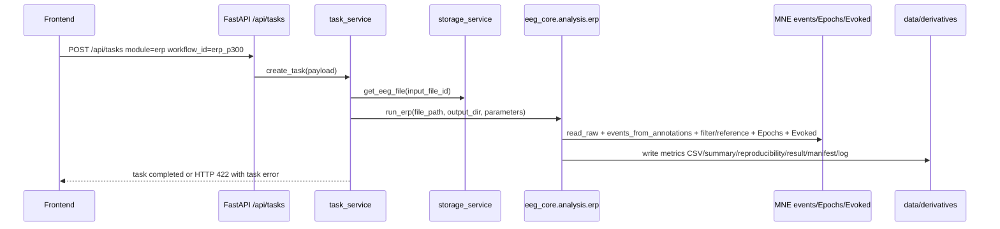

# ERP 功能详细设计

更新时间：2026-06-18

## 1. 文档定位

本文件是 QLanalyser Online ERP 功能的详细设计，供前端交互、后端 runner、报告交付、验收脚本和后续开发对话共同使用。

上游依据：

- `docs/modules/mne_analysis_function_design_basis.md`
- `docs/modules/analysis_modules_design_matrix.md`
- `docs/modules/qc_design.md`
- `docs/architecture/system_architecture.md`
- `docs/architecture/version_detailed_design.md`

当前实现参考：

- `eeg_core/analysis/erp.py`
- `backend/services/task_service.py`
- `scripts/smoke_v01_api.py`
- `scripts/acceptance_v01_full.py`

## 2. 功能定位

ERP 用于基于事件标记或 annotations 对 EEG 进行事件锁定分段，计算条件平均波形，并提取 N100、P200、P300 等时间窗指标。

当前状态：event 条件下 beta/stable。

当前 job / workflow：

- API module：`erp`
- workflow id：`erp_p300`
- core runner：`run_erp(input_path, output_dir, parameters)`
- MNE 主对象：`mne.Epochs`、`mne.Evoked`
- MNE 事件来源：`mne.events_from_annotations(raw)`

ERP 不是无条件 stable。只有当文件包含可解释的事件标记，且用户或系统能确认 `event_id` 语义时，ERP 结果才可作为科研交付物。没有事件或事件语义不清时，必须失败或标记为需要人工复核。

## 3. 用户目标

用户上传带事件的 EEG 后，希望得到：

1. 文件是否存在可用事件。
2. 哪些 condition 被用于 ERP。
3. 每个 condition 的有效 epoch 数。
4. N100 / P200 / P300 等窗口的幅值和潜伏期指标。
5. 可复核的方法说明、参数、软件版本和输出清单。
6. 对 marker timing、条件语义、baseline、reject 和 trial 数量的风险提示。

客户界面应把重点放在“事件、时间窗、结果表、复现材料、解释边界”，不要反复解释软件本身。

## 4. 当前数据流



当前 API 执行仍在请求链路内同步完成。v0.2+ 可接 runner adapter / queue，但 ERP 输出契约不应变化。

## 5. 输入设计

### 必需输入

- EEG 文件 ID：由上传流程产生。
- workflow id：`erp_p300`。
- module：`erp`。
- 文件中必须存在 annotations/event markers。

### 支持文件格式

通过 `eeg_core/io/readers.py` 读取：

- EDF / BDF：`mne.io.read_raw_edf`
- EEGLAB SET：`mne.io.read_raw_eeglab`
- BrainVision VHDR：`mne.io.read_raw_brainvision`
- FIF：`mne.io.read_raw_fif`
- CNT：`mne.io.read_raw_cnt`

### 当前参数

| 参数 | 类型 | 当前默认 | 说明 |
| --- | --- | --- | --- |
| `event_id` | object/null | 从 annotations 自动发现 | condition 名到事件编码的映射，例如 `{"target": 2}`。 |
| `l_freq` | float/null | `0.1` | ERP 前高通滤波下限。 |
| `h_freq` | float/null | `30.0` | ERP 前低通滤波上限。 |
| `reference` | string/list/null | `average` | 当前默认平均参考；传 null/空值则不重参考。 |
| `tmin` | float | `-0.2` | epoch 起点，单位秒。 |
| `tmax` | float | `0.8` | epoch 终点，单位秒。 |
| `baseline` | list/null | `[null, 0.0]` | baseline correction 区间。 |
| `reject_eeg_uv` | float/null | null | EEG epoch reject 阈值，单位 microvolt，内部转为 volt。 |
| `components` | object/null | N100/P200/P300 默认窗口 | 成分名到秒级时间窗的映射。 |

当前默认成分窗口：

| component | 秒 | 毫秒 |
| --- | --- | --- |
| N100 | 0.08-0.14 | 80-140 ms |
| P200 | 0.16-0.26 | 160-260 ms |
| P300 | 0.28-0.45 | 280-450 ms |

### v0.2 待显式开放参数

- 事件来源选择：annotations / stim channel / 上传事件表。
- event preview 和 event_id 映射确认 UI。
- ROI 通道，例如 Pz/P3/P4 或用户自定义通道组。
- 每个 component 的极性、搜索策略、均值/峰值策略。
- reject / flat 规则、drop log 导出策略。
- condition contrast，例如 target-standard。

## 6. MNE 和算法映射

当前实现步骤：

1. `read_raw(input_path, preload=True)` 读取文件。
2. 检查是否存在 EEG 通道。
3. 读取 `parameters.event_id`；如果提供则必须是 dict。
4. 调用 `mne.events_from_annotations(raw)` 获取 `events` 和 discovered `event_id`。
5. 如果文件无事件，失败：`ERP analysis requires event markers or annotations; none were found`。
6. 如果未提供 `event_id`，使用 MNE 自动发现的映射。
7. 过滤 `event_id`：只保留文件实际存在的事件编码。
8. 如果没有任何目标事件存在，失败：`None of the requested ERP event_id values are present in the file`。
9. 对 Raw 执行 `raw.filter(l_freq, h_freq)`。
10. 如 `reference` 非空，执行 `raw.set_eeg_reference(reference)`。
11. 构造 `mne.Epochs(raw, events, event_id=selected, tmin, tmax, baseline, reject, preload=True)`。
12. 如果 epoching/rejection 后没有有效 epoch，失败。
13. 对每个 condition 执行 `epochs[condition].average()` 得到 `Evoked`。
14. 对每个 component 时间窗提取所有 EEG 通道平均波形中的 peak amplitude 和 latency。
15. 写出 metrics、summary、方法说明、复现文件和统一输出契约。

## 7. 输出设计

当前 ERP 输出目录位于：

```text
data/derivatives/{project_id}/{task_id}/
```

必须输出：

```text
tables/erp_metrics.csv
reproducibility/erp_summary.json
reproducibility/parameters.json
reproducibility/method_description.txt
reproducibility/software_versions.json
reproducibility/workflow.json
result.json
manifest.json
log.txt
```

### `tables/erp_metrics.csv`

用途：给用户和后续统计使用的 condition x component 指标表。

当前字段：

- `condition`
- `component`
- `window_ms`
- `amplitude_uv`
- `latency_ms`
- `n_epochs`

### `reproducibility/erp_summary.json`

必须包含：

- `status`
- `engine`
- `events_total`
- `event_id`
- `epochs_total`
- `sfreq`
- `conditions`
- `parameters`

`conditions` 当前记录每个 condition 的：

- `n_epochs`
- `n_channels`
- `comment`

### `method_description.txt`

必须说明：

- 使用 MNE annotations/events 建立 epoch。
- 对 epoch 做 baseline correction。
- 按 condition 平均为 Evoked。
- 提取 N100/P200/P300 窗口的幅值和潜伏期。
- marker timing 和 condition 语义必须在解释前确认。

## 8. 校验规则

运行 ERP 前必须校验：

- 文件可读。
- 至少有一个 EEG 通道。
- 文件存在 annotations/events。
- `event_id` 是 dict，且值能转换为 int。
- 目标 event code 至少一个存在于 events。
- `tmin < tmax`。
- baseline 为 null 或二元数组，且位于 epoch 时间范围内。
- `l_freq < h_freq`，且滤波频率合理。
- `reject_eeg_uv` 大于 0。
- component 时间窗必须在 `[tmin, tmax]` 内。
- epoching/rejection 后至少保留一个 epoch。

当前实现已覆盖：

- 无 EEG 通道失败。
- `event_id` 非 dict 失败。
- 无 annotations/events 失败。
- 请求的 event_id 不存在失败。
- epoching/rejection 后无有效 epoch 失败。
- 无可用 EEG 通道做 metrics 失败。

当前实现待补：

- 对 `tmin/tmax/baseline/components/reject/filter/reference` 做显式用户级错误信息。
- 输出 drop log 或 rejected epoch 数。
- 区分 “文件无事件” 和 “事件存在但语义未确认”。
- 支持 stim channel 或上传事件表，不只依赖 annotations。

## 9. 失败模式与用户提示

| 失败模式 | 当前来源 | 用户提示方向 |
| --- | --- | --- |
| 不支持的 EEG 格式 | `read_raw` | 请上传 EDF/BDF/FIF/BrainVision/SET/CNT。 |
| 没有 EEG 通道 | ERP runner | 当前文件没有识别到 EEG 通道，无法计算 ERP。 |
| 无 annotations/events | `events_from_annotations` / runner | 当前文件没有可用事件标记，ERP 需要事件时间点。 |
| `event_id` 格式错误 | ERP runner | event_id 必须是 condition 到事件编码的映射。 |
| 目标事件不存在 | ERP runner | 选择的事件编码没有出现在文件中，请检查 marker 映射。 |
| epoch/reject 后无有效 epoch | MNE Epochs / runner | 当前时间窗或拒绝阈值过严，未保留有效 trial。 |
| baseline 越界 | MNE Epochs / 待补显式校验 | baseline 必须落在 epoch 时间范围内。 |
| component 窗口越界 | 当前待补 | 成分时间窗必须位于 epoch 时间范围内。 |

失败时 task 应进入 `failed`，保留 `error_message`，API 当前以 HTTP 422 返回 `task_id` 和错误信息。

## 10. 图表与展示设计

v0.1 当前后端主要输出 metrics 表和复现文件。体验中心或正式工作台展示 ERP 时建议：

- 事件摘要：condition、event code、事件数量。
- epoch 摘要：每个 condition 的有效 epoch 数和 rejection 提示。
- ERP 波形：每个 condition 一条曲线，默认显示主要 ROI 或全通道平均。
- component 表：N100、P200、P300 的 amplitude / latency。
- 方法和参数：tmin/tmax、baseline、filter、reference、reject、event_id。

展示文案应强调“事件必须确认”：

- 推荐：`事件映射`、`时间窗`、`有效片段`、`成分指标`、`方法和参数`。
- 避免：把 P300 结果直接解释成注意力、认知或疾病结论。

## 11. 科研解释边界

ERP 报告必须提醒：

- ERP 的前提是 marker timing 和 condition 语义正确。
- baseline 区间、滤波、参考方式和 reject 阈值会影响幅值和潜伏期。
- trial 数过少时，平均波形不稳定。
- 默认 N100/P200/P300 时间窗是通用模板，不适用于所有范式。
- 当前指标是通道平均后的窗口峰值，不等同于已完成的 ROI/组统计分析。
- 单文件 ERP 不能推出诊断结论。

## 12. 与 QC / PSD / TFR 的关系

ERP 进入条件：

- QC 文件可读。
- EEG 通道数大于 0。
- 文件中存在可用事件。
- 事件语义被用户或实验记录确认。
- epoch 时间窗不超出数据边界。
