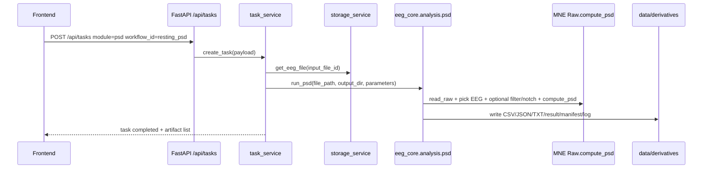

# PSD 功能详细设计

更新时间：2026-06-18

## 1. 文档定位

本文件是 QLanalyser Online PSD 功能的详细设计，供前端交互、后端 runner、报告交付、验收脚本和后续开发对话共同使用。

上游依据：

- `docs/modules/mne_analysis_function_design_basis.md`
- `docs/modules/analysis_modules_design_matrix.md`
- `docs/modules/qc_design.md`
- `docs/architecture/system_architecture.md`
- `docs/architecture/version_detailed_design.md`

当前实现参考：

- `eeg_core/analysis/psd.py`
- `backend/services/task_service.py`
- `scripts/smoke_v01_api.py`
- `scripts/acceptance_v01_full.py`

## 2. 功能定位

PSD 用于对静息态或连续 EEG 片段计算功率谱密度和频段功率，帮助科研用户快速获得可复核的频谱和 band power 表。

当前状态：v0.1 stable。

当前 job / workflow：

- API module：`psd`
- workflow id：`resting_psd`
- core runner：`run_psd(input_path, output_dir, parameters)`
- MNE 主方法：`Raw.compute_psd(method="welch")`

PSD 在 v0.1 只做单文件、单任务、单被试级输出，不做组统计、疾病判读、自动临床解释、source-level 频谱或网络分析。

## 3. 用户目标

用户上传 EEG 后，希望得到：

1. 当前文件是否能做 PSD。
2. 可下载的频段功率表和通道级频段功率表。
3. 可复核的方法说明、参数、软件版本和输出清单。
4. 对结果解释边界的提醒，例如参考方式、伪迹、预处理和个体 alpha 峰差异。

客户界面文案应简洁，避免重复解释软件本身是什么。功能页重点展示“参数、结果、下载、风险提示”，不反复堆叠“分析 / 功能 / 模块 / 入口”等词。

## 4. 当前数据流



当前 API 执行仍在请求链路内同步完成。v0.2+ 可接 runner adapter / queue，但 PSD 输出契约不应变化。

## 5. 输入设计

### 必需输入

- EEG 文件 ID：由上传流程产生。
- workflow id：`resting_psd`。
- module：`psd`。

### 支持文件格式

通过 `eeg_core/io/readers.py` 读取：

- EDF / BDF：`mne.io.read_raw_edf`
- EEGLAB SET：`mne.io.read_raw_eeglab`
- BrainVision VHDR：`mne.io.read_raw_brainvision`
- FIF：`mne.io.read_raw_fif`
- CNT：`mne.io.read_raw_cnt`

### 可选参数

当前 runner 已支持：

| 参数 | 类型 | 当前默认 | 说明 |
| --- | --- | --- | --- |
| `fmin` | float | `1.0` | PSD 输出最低频率，必须大于等于 0。 |
| `fmax` | float | `min(40.0, sfreq / 2 - 1.0)` | PSD 输出最高频率，必须低于 Nyquist。 |
| `l_freq` | float/null | null | 可选高通滤波下限，调用 `Raw.filter`。 |
| `h_freq` | float/null | null | 可选低通滤波上限，调用 `Raw.filter`。 |
| `notch_freq` | float/null | null | 可选工频陷波，当前只接受单个频率并转为数组。 |

当前 runner 隐含参数：

- MNE PSD 方法固定为 Welch。
- EEG picks 固定为 EEG 通道，排除 `bads`。
- `preload=True`。
- band 定义固定在代码常量 `BANDS`。

### v0.2 待显式开放参数

- Welch `n_fft`、`n_overlap`、`window`。
- `reject_by_annotation`。
- picks / ROI 通道集合。
- band 自定义和频段命名。
- absolute / relative power 输出策略。
- 多时间窗或 eyes-open / eyes-closed 条件标签。

## 6. MNE 和算法映射

当前实现步骤：

1. `read_raw(input_path, preload=True)` 读取文件。
2. 检查是否存在 EEG 通道。
3. `raw.copy().pick_types(eeg=True, meg=False, eog=False, ecg=False, stim=False, exclude="bads")` 选择 EEG 通道并排除坏道。
4. 如果传入 `l_freq` 或 `h_freq`，调用 `picks.filter(l_freq, h_freq)`。
5. 如果传入 `notch_freq`，调用 `picks.notch_filter(freqs=np.atleast_1d(float(notch)))`。
6. 设置 `fmin` / `fmax`。
7. 调用 `picks.compute_psd(method="welch", fmin=fmin, fmax=fmax, verbose="ERROR")`。
8. 从 `Spectrum` 提取 `freqs`、`ch_names`、PSD 矩阵。
9. 按固定频段平均得到 band power。
10. 写出 CSV、summary、方法说明、复现文件和统一输出契约。

当前固定频段：

| band | 范围 Hz |
| --- | --- |
| delta | 1-4 |
| theta | 4-8 |
| alpha | 8-13 |
| beta | 13-30 |
| gamma_low | 30-40 |

注意：当前频段边界是工程默认，不代表所有研究范式的最佳定义。后续 UI 应允许项目级模板覆盖。

## 7. 输出设计

当前 PSD 输出目录位于：

```text
data/derivatives/{project_id}/{task_id}/
```

必须输出：

```text
tables/band_power.csv
tables/channel_band_power.csv
figures/psd_band_power.svg
reproducibility/psd_summary.json
reproducibility/parameters.json
reproducibility/method_description.txt
reproducibility/software_versions.json
reproducibility/workflow.json
result.json
manifest.json
log.txt
```

### `tables/band_power.csv`

用途：给用户一个每个频段的全通道平均功率概览。

当前字段：

- `band`
- `fmin`
- `fmax`
- `mean_psd`

### `tables/channel_band_power.csv`

用途：给后续统计、绘图和报告使用的通道 x 频段长表。

当前字段：

- `channel`
- `band`
- `fmin`
- `fmax`
- `mean_psd`

### `reproducibility/psd_summary.json`

必须包含：

- `channels`
- `sfreq`
- `freq_range_hz`
- `freq_bins`
- `bands`
- `band_power_mean`

### `method_description.txt`

必须说明：

- 使用 MNE-Python Welch PSD。
- 频段功率是对 canonical bands 内功率平均。
- 解释必须考虑参考方式、预处理、伪迹和个体 alpha peak 差异。

## 8. Band Power as PSD view/alias

Band Power 在 07 主线中不是独立后端模块，而是 PSD 的视图/别名。生产实现必须复用现有 `/api/tasks` 任务入口，提交 `module=psd`、`workflow_id=resting_psd`，不新开 API、不改 IPC、不新增 runner/router/Headroom 通道。

Band Power 交付物来自 PSD 输出契约：

- `tables/band_power.csv`
- `tables/channel_band_power.csv`
- `figures/psd_band_power.svg`

前端可把该视图展示为“频段功率”或 “Band Power”，但 manifest、任务 payload、报告复现链路仍应指向 PSD/resting_psd。后续若需要单独的 Band Power 页面，应只做 UI alias 和下载入口聚合，不能重复造一套 PSD 后端计算模块。

与 AR_analyser1 legacy 口径的差异必须显式标注：AR 频段为 Delta 0.5-4 Hz、Alpha 8-12 Hz、Beta 12-30 Hz，并使用 PSD bin sum；07 PSD 当前主线默认频段为 delta 1-4、theta 4-8、alpha 8-13、beta 13-30、gamma_low 30-40，当前文档口径为 canonical band 内功率平均。legacy 逐数值对照仅在业务明确要求复核历史结果时再做，不作为 07 主线默认交付。

边界说明：Band Power 是科研频段功率视图，用于描述 EEG 频谱功率分布和复现分析流程，不用于诊断、治疗或医疗决策。

## 9. 校验规则

运行 PSD 前必须校验：

- 文件可读。
- 至少有一个 EEG 通道。
- 排除 bads 后至少还有一个可用 EEG 通道。
- `fmin >= 0`。
- `fmax < sfreq / 2`。
- `fmin < fmax`。
- 如果传入滤波参数，`l_freq < h_freq`，且二者均在合理范围。
- 如果传入 `notch_freq`，必须大于 0 且小于 Nyquist。

当前实现已覆盖：

- 无 EEG 通道失败。
- 排除 bads 后无可用 EEG 通道失败。
- 基础读取失败由 reader / MNE 抛出。

当前实现待补：

- 对 `fmin/fmax`、滤波、notch 参数做显式用户级错误信息。
- 对 `fmax` 接近或超过 Nyquist 的错误进行提前拦截。
- 对空频段或频段超出 `fmin/fmax` 的情况写入 warning。

## 10. 失败模式与用户提示

| 失败模式 | 当前来源 | 用户提示方向 |
| --- | --- | --- |
| 不支持的 EEG 格式 | `read_raw` | 请上传 EDF/BDF/FIF/BrainVision/SET/CNT。 |
| 文件损坏或无法读取 | MNE reader | 文件无法解析，请检查导出完整性或重新上传。 |
| 没有 EEG 通道 | PSD runner | 当前文件没有识别到 EEG 通道，无法计算频谱。 |
| 坏道排除后无可用通道 | PSD runner | 所有 EEG 通道都被标记为不可用，请先复核 QC。 |
| `fmax` 超过 Nyquist | 待补显式校验 | 最高频率不能超过采样率的一半。 |
| 滤波参数不合法 | MNE filter / 待补 | 请检查高通/低通频率设置。 |
| 频段无频点 | 当前可能产生 NaN | 当前采样率或频率范围不足以覆盖该频段。 |

失败时 task 应进入 `failed`，保留 `error_message`，并尽量写入 `log.txt` 或任务状态。后续改造应让失败也产生最小可读 manifest。

## 11. 图表与展示设计

v0.1 当前后端主要输出表格和复现文件。体验中心或正式工作台展示 PSD 时建议：

- 频谱曲线：横轴 Hz，纵轴功率或 log power。
- band power 条形图：delta/theta/alpha/beta/gamma_low。
- Band Power alias 图：优先使用 `figures/psd_band_power.svg`，缺失时由 `tables/band_power.csv` 渲染同等内容。
- 通道热力表：channel x band。
- Topomap：作为后续增强，前提是 montage 足够可靠。

展示文案要避免过度解释：

- 推荐：`频段功率`、`通道表`、`方法和参数`、`下载结果`。
- 避免：反复写“QLanalyser 分析功能模块入口”。

## 12. 科研解释边界

PSD 报告必须提醒：

- 绝对功率受参考方式、阻抗、颅骨/头皮条件和预处理影响。
- 高幅伪迹、眼动、肌电、坏道会显著影响频谱。
- alpha 峰存在个体差异，固定 8-13 Hz 只是默认频段。
- 单文件 PSD 不能推出诊断结论。
- Band Power 只是科研频段功率视图，不用于诊断、治疗或医疗决策。
- 跨被试比较必须在一致预处理、参考、频段和统计设计下进行。

## 13. 与 QC / 预处理的关系

PSD 进入条件：

- V1 中 PSD 不直接读取原始 `data_preparation_plan.json`。
- C1/C2/task_service 负责按 `data_preparation_plan_id` 和 `data_preparation_revision` 读取并归一化方案。
- PSD 接收归一化后的任务参数，验证并应用 `bad_channels`、`bad_segments`、`annotation_actions`。
- `bad_channels` 必须是通道名字符串列表。不存在于当前文件的通道只记录为未应用风险，不应导致崩溃。
- `bad_segments` 支持 `{onset, duration}`，也支持 PSD 本地安全转换 `{start_sec, end_sec}`。
- `annotation_actions` 在 PSD P0 中仅记录；如果需要影响计算，上游必须先归一化为 `bad_segments`。
- PSD 输出必须在 summary、parameters、workflow、log、result contract 中保留 `data_preparation_plan_id` 和 `data_preparation_revision`，以便复核同一套 QC 决策。
