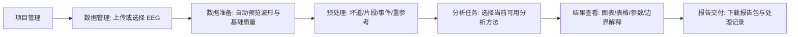
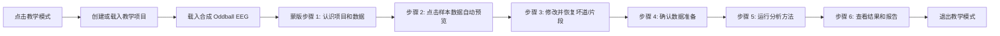

# QLanalyser 当前可用分析方法、教学模式与科研工作流详细设计

Date: 2026-06-26
Source requirements: `docs/product/qlanalyser_current_modules_teaching_mode_requirements_20260626.md`
Repo: `D:\Quanlan\Codes\Python\quanlan-analyser-official`
Status: detailed design before implementation

## 1. Design Goals

This design turns the requirements into implementable product behavior. The primary design goal is to make QLanalyser feel like a researcher-facing EEG workflow:

- The user starts from a project and data record.
- Data preparation is the place for QC, waveform, bad channels, bad segments, events, and re-reference decisions.
- Analysis methods are only methods that compute analysis outputs.
- Teaching mode lets a new user run the real workflow with synthetic data.
- The product copy avoids internal engineering language and avoids scientific overclaims.

## 2. Architecture Boundary

### 2.1 Frontend

Primary files:

- `frontend/index.html`: static shell, navigation, method cards, top-right actions.
- `frontend/app.js`: dynamic copy, state transitions, action handlers, teaching-mode behavior.
- `frontend/styles.css`: navigation/topbar, method cards, data-preparation workbench, teaching overlay, color/token治理.

Frontend must provide:

- Top-right `教学模式` control.
- Global `个人中心` reachability.
- `当前可用分析方法` card list with 8 true method cards.
- Data-preparation re-reference UI.
- Teaching overlay state machine.
- Forbidden-copy prevention in customer surfaces.

### 2.2 Backend

Primary files:

- `backend/services/lab_demo_service.py`
- `backend/api/lab_demo.py`
- `backend/services/task_service.py`
- `eeg_core/analysis/reference_csd.py`

Backend must preserve existing task compatibility. The stable backend id `reference_csd` can remain, but user-facing labels must use `CSD 电流源密度计算` when the user is selecting the CSD analysis method. Re-reference modes stay available as preprocessing settings or internal transformation modes.

### 2.3 Existing source facts

Observed source behavior before implementation:

- `frontend/index.html` and `frontend/app.js` currently expose `当前可用模块`, `预览方法`, `需复核`, and `Reference / CSD`.
- `backend/services/task_service.py` currently declares workflow id `reference_csd` with display name `Reference / CSD`.
- `eeg_core/analysis/reference_csd.py` supports modes `keep_original`, `existing`, `average`, `specific_channels`, `bipolar`, and `csd`; CSD calls `mne.preprocessing.compute_current_source_density`.
- `eeg_core/analysis/reference_csd.py` already enforces `MONTAGE_REQUIRED_FOR_CSD` when CSD lacks montage/channel locations.
- `backend/services/lab_demo_service.py` already creates `teaching_oddball.edf` and a demo project/file.

## 3. User Flow Design

### 3.1 Normal researcher flow



### 3.2 Teaching mode flow



## 4. Component Design

### 4.1 Global topbar

Required controls:

- `教学模式`: visible for customer role pages; opens teaching overlay and demo dataset.
- `知识库`: opens help/knowledge panel.
- `操作记录`: opens audit/activity record.
- `退出`: logout.

Personal center:

- `个人中心` remains visible in left navigation and account panel.
- If screen width hides side navigation, a topbar/account shortcut must still reach personal center.

### 4.2 Data preparation workbench

Layout:

- Left: data queue/list.
- Center: waveform preview and direct tools.
- Right: quality summary and current modifications.
- Bottom or top-right: `确认并进入分析`.

Rules:

- Single-clicking a data row selects it and starts waveform/QC preview.
- The previous primary button `运行质控预览` is removed. Only failure/retry states may show `重新加载预览`.
- Bad channel, bad segment, event edit, and re-reference settings are stored as reversible preparation actions.
- Re-reference settings must show mode, affected channels, output preview/record, and restore path.

### 4.3 Current available analysis methods

Card contract:

| Field | Design |
|---|---|
| title | User-facing method name. |
| body | What the researcher gets from the method. |
| input requirement | Events, channel locations, prepared data, or minimum channels. |
| output | Figure/table/report artifacts. |
| boundary | No unsupported clinical, source, causal, or significance claim. |
| action | Start method or open parameter panel. |

Cards:

1. `PSD 频谱与频段功率`
2. `ERP 事件相关电位`
3. `TFR 时频分析`
4. `Multitaper PSD`
5. `Multitaper TFR`
6. `PAC 相位-振幅耦合`
7. `Connectivity 连接性分析`
8. `CSD 电流源密度计算`

Not cards:

- 数据准备与质量检查
- 重参考设置
- 平均参考
- 指定通道参考
- 双极参考

### 4.4 CSD detailed behavior

User-facing title: `CSD 电流源密度计算`.

Visible explanation:

> 基于通道位置信息计算头皮电位的空间分布变化，用于观察传感器空间的局部变化；这不是脑源定位或诊断判断。

Run conditions:

- At least two usable EEG channels.
- Montage/channel locations present.
- Parameters recorded: sphere, lambda2, stiffness, n_legendre_terms.

Failure state:

- If channel locations are missing, do not show a generic failure. Show: `CSD 需要通道位置信息。请为数据补充 montage/电极位置后再运行。`

Backend compatibility:

- Keep `reference_csd` as a backend id if required by existing tasks.
- When user selects CSD, send `reference_mode=csd`.
- Re-reference modes do not appear as analysis method cards.

## 5. Teaching Overlay State Machine

State fields:

```json
{
  "teachingMode": true,
  "stepIndex": 0,
  "datasetLoaded": true,
  "demoProjectId": "proj_demo_learning",
  "demoFileId": "eeg_demo_teaching_oddball",
  "isDemoData": true
}
```

Overlay component:

- `role="dialog"` or equivalent accessible modal semantics.
- Mask dims the page but leaves target visibly framed.
- Step pointer must not cover the target action.
- Controls: `上一步`, `下一步`, `结束教学`.
- Escape or `结束教学` exits without deleting real project state.
- Reduced-motion users get no animated scrolling.

Step list:

| Step | Target | User instruction |
|---|---|---|
| T1 | topbar `教学模式` | 进入教学模式，系统载入一份合成 EEG 数据。 |
| T2 | project card/data list | 查看教学项目和样本数据。 |
| T3 | data row | 单击数据，波形和基础质量信息自动加载。 |
| T4 | waveform toolbar | 标记一个坏道或片段，再恢复它。 |
| T5 | re-reference panel | 查看重参考设置，理解它属于预处理。 |
| T6 | confirm preparation | 确认数据准备并进入分析。 |
| T7 | method cards | 选择一个分析方法，了解输入、输出和边界。 |
| T8 | result/report | 查看图表、参数记录和报告下载入口。 |

## 6. Visual Design Rules

Knowledge-base rules adopted:

- `DESIGN_TOKEN_GOVERNANCE_GATE`: use semantic colors, status colors, focus rings, spacing scale, radius/elevation tokens where the project supports them.
- `UX_STATE_COVERAGE_GATE`: cover ideal, empty, loading, error, success, disabled/focus, narrow/wide viewport.
- `QLANALYSER_CRITICAL_TASK_ONBOARDING_GATE`: onboarding is contextual help for critical tasks, not only a welcome page.
- `B2B_SCIENTIFIC_DASHBOARD_VISUAL_ANTIPATTERN_FIXTURES`: no unclear first landing point, no developer-looking function dump, no dense unreadable cards, no unscannable hierarchy.
- Scientific chart rules: no rainbow/jet default for quantitative EEG results; charts need axes, units, colorbar/legend, baseline/normalization notes where relevant.

Visual tone:

- Quiet research workbench, not marketing page.
- Dense but readable information hierarchy.
- Neutral surfaces with semantic accent colors.
- Avoid one-note green sidebar or one-hue dominated theme.
- Cards only for repeated items or framed tools; avoid nested cards.
- Icon buttons use familiar icons and tooltips where needed.

## 7. State and Error Design

Required states:

| Surface | Empty | Loading | Success | Error/recovery |
|---|---|---|---|---|
| Data list | Explain how to upload/use teaching data | Skeleton or stable row placeholders | Rows selectable | Retry load, no local absolute path leak |
| Waveform/QC | Select data or enter teaching mode | Reading waveform and quality info | Waveform + tools visible | `重新加载预览` |
| Re-reference | Show default mode | Applying settings | Processing record updated | Restore previous mode |
| Method cards | Explain data requirements | Checking readiness | Runnable actions | Show unmet condition and next action |
| Teaching overlay | Not active | Loading demo dataset | Step guidance | Continue with last valid state or exit teaching |
| Report delivery | No completed task | Packaging | Download report/record | Retry package, preserve task id |

## 8. Implementation Sequence

1. Update documents and DeepSeek review packet.
2. Add/adjust tests for forbidden copy, 8 visible analysis methods, global topbar, teaching overlay, CSD readiness, and synthetic full E2E.
3. Implement UI copy and IA changes.
4. Implement or wire teaching-mode state and overlay.
5. Verify syntax/mojibake/copy.
6. Run backend/API synthetic demo checks.
7. Run browser E2E screenshots and method tests.
8. Build final acceptance packet.

## 9. Non-goals

- Do not redesign backend task IDs if compatibility would break existing evidence.
- Do not make QLanalyser a clinical/medical diagnostic product.
- Do not remove reproducibility records; move them out of the main user action area.
- Do not claim real-world scientific validity from synthetic EEG fixtures.
