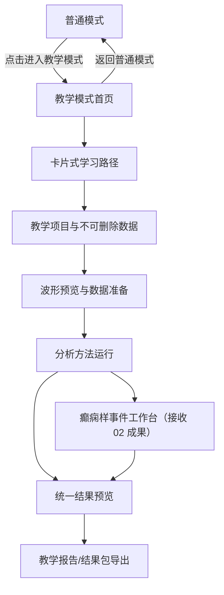

# QLanalyser 教学模式独立产品形态详细设计与 UI 设计稿

生成时间：2026-06-26T10:35:39.972886+00:00
文档状态：实施前设计稿 v1

## 1. 设计原则

采用 QLanalyser 科研 B 端工作台原则：先任务后美观、先数据语义后图形样式、先状态完整后视觉 polish、先科学边界后视觉冲击、先可访问性后高级感。

端到端教学路径必须从模式切换开始，经过教学数据、波形/数据准备、方法运行、结果预览和导出，最终形成可重复的学习闭环。

## 2. 信息架构



## 3. 顶部模式切换

普通模式：

```text
┌────────────────────────────────────────────────────────────────────┐
│ QLanalyser Online                 [进入教学模式] [个人中心]          │
│ 当前项目：未选择 / 当前数据：未选择 / 下一步：先选择项目              │
└────────────────────────────────────────────────────────────────────┘
```

教学模式：

```text
┌────────────────────────────────────────────────────────────────────┐
│ QLanalyser 教学模式             [返回普通模式] [重置教学进度] [个人中心] │
│ 正在使用内置教学数据：Oddball EEG / 癫痫样事件 EEG                   │
│ 说明：教学结果用于学习和流程试运行，不进入普通项目报告。              │
└────────────────────────────────────────────────────────────────────┘
```

## 4. 教学模式首页 UI 线框

```text
┌────────────────────────────────────────────────────────────────────┐
│ 教学模式：用内置 EEG 跑通完整分析流程                               │
│ 先跟随卡片了解流程，再使用教学数据运行每个方法。                    │
│ [开始引导] [直接进入教学项目] [查看已完成步骤 3/10]                 │
├────────────────────────────────────────────────────────────────────┤
│ 学习路径                                                           │
│ ┌──────────┐ ┌──────────┐ ┌──────────┐ ┌──────────┐               │
│ │1 认识数据│ │2 看波形  │ │3 数据准备│ │4 频域分析│               │
│ └──────────┘ └──────────┘ └──────────┘ └──────────┘               │
│ ┌──────────┐ ┌──────────┐ ┌──────────┐ ┌──────────┐               │
│ │5 时频分析│ │6 PAC     │ │7 事件筛查│ │8 结果导出│               │
│ └──────────┘ └──────────┘ └──────────┘ └──────────┘               │
├────────────────────────────────────────────────────────────────────┤
│ 教学数据                                                           │
│ Oddball EEG：适合 ERP/PSD/TFR/PAC       [打开数据] [查看说明]       │
│ 癫痫样事件 EEG：适合候选事件筛查        [打开工作台] [查看说明]      │
└────────────────────────────────────────────────────────────────────┘
```

## 5. 蒙版引导设计

```text
┌────────────────────────────────────────────────────────────────────┐
│ 页面半透明遮罩覆盖，目标控件保持高亮                                │
│                 ┌──────────────────────────────┐                   │
│                 │ 第 2/10 步：查看教学数据      │                   │
│                 │ 这里是内置 Oddball EEG。       │                   │
│                 │ 它不能删除，用于练习全流程。   │                   │
│                 │ [上一步] [下一步] [跳过]       │                   │
│                 └──────────────────────────────┘                   │
└────────────────────────────────────────────────────────────────────┘
```

引导步骤：进入教学模式、认识数据、查看波形、数据准备、运行 PSD、查看 Band Power、运行时频、运行 PAC、进入癫痫工作台、导出结果。

## 6. 教学项目与数据设计

```json
{
  "project_id": "proj_teaching_workspace",
  "mode": "teaching",
  "protected": true,
  "datasets": [
    {
      "file_id": "eeg_demo_teaching_oddball",
      "label": "Oddball 教学 EEG",
      "protected": true,
      "delete_policy": "not_allowed",
      "recommended_methods": ["qc", "erp", "psd", "band_power", "tfr", "multitaper_psd", "multitaper_tfr", "pac"]
    },
    {
      "file_id": "eeg_demo_epilepsy_ml_trigger",
      "label": "癫痫样事件教学 EEG",
      "protected": true,
      "delete_policy": "not_allowed",
      "recommended_methods": ["epilepsy_std", "epilepsy_ml"]
    }
  ]
}
```

## 7. API 建议

| API | 用途 | 备注 |
|---|---|---|
| `GET /api/lab/demo/teaching` | 确保教学项目和通用数据存在 | 返回教学项目、数据、推荐方法 |
| `GET /api/lab/demo/epilepsy` | 确保癫痫教学数据存在 | 接收 02 成果后启用 |
| `POST /api/teaching/progress` | 保存引导步骤进度 | 可重置 |
| `GET /api/teaching/progress` | 读取引导进度 | 区分用户/浏览器 |
| `DELETE /api/eeg/files/{id}` | 删除保护 | 若教学数据返回 `TEACHING_DATASET_PROTECTED` |

## 8. 组件设计

### 8.1 模式切换组件

状态：normal、teaching、loading、error。

### 8.2 教学路径卡片

字段：步骤编号、标题、预计动作、依赖状态、完成状态、CTA。

### 8.3 统一结果预览

```text
顶部：方法名称 / 教学数据 / 运行状态 / 非医疗边界
左侧：输入数据、关键参数、教学解释
中间：主要图表、表格摘要
右侧：输出文件、下载、下一方法建议
底部：mini-check：你能回答这个结果不能说明什么吗？
```

## 9. 视觉规范

| token | 用途 | 建议 |
|---|---|---|
| `--mode-teaching-bg` | 教学模式背景 | `#eef8fb` / 浅青蓝 |
| `--mode-teaching-border` | 教学卡边框 | `#b8e1ea` |
| `--status-learning` | 学习状态 | 青蓝，不用警示色 |
| `--status-protected` | 不可删除标记 | 蓝灰 chip |
| `--focus-ring` | 键盘焦点 | 2px 高对比蓝 |

教学模式更有引导感，但仍保持科研工具气质；不用卡通化、大面积插画或营销感。

## 10. 状态设计

| 状态 | UI 表达 | 恢复动作 |
|---|---|---|
| 教学数据加载中 | skeleton + 阶段文字 | 等待/重试 |
| 教学数据缺失 | 空状态说明 | 一键重新准备教学数据 |
| 方法运行中 | 长任务阶段条 | 后台运行/查看任务 |
| 方法失败 | 错误卡 + 任务 ID | 重试/复制错误摘要 |
| 教学数据不可删 | 禁用删除或隐藏 | 解释原因 |
| 已完成步骤 | 完成 chip | 下一方法 |

## 11. 与 02 癫痫成果的集成边界

02 负责癫痫 ML 高保真迁移、预置癫痫 fixture、癫痫工作台。07 教学模式只接收其同源成果，不 fork 第二套癫痫教学逻辑。

## 12. 设计验收门

```yaml
QLANALYSER_DASHBOARD_REFERENCE_SELECTION:
  surface: teaching_mode_workspace
  task: end_to_end_method_learning
  user_role: researcher / student / lab_engineer
  selected_reference_systems:
    - Carbon: state, empty, progress, structured dashboard
    - PatternFly: enterprise workspace layout and status severity
    - GOV.UK: clear task wording and error recovery
    - QLanalyser scientific chart rules: EEG/domain-specific chart boundaries
  required_screenshot_states:
    - normal_mode_default
    - teaching_mode_default
    - onboarding_overlay
    - teaching_dataset_protected
    - method_running
    - result_preview
    - error_recovery
    - narrow_viewport
  decision: must_be_evidence_based
```
