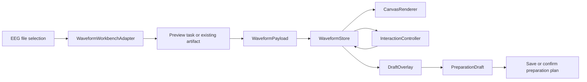

# QLanalyser WaveformWorkbench 独立模块详细设计

版本：2026-06-27  
分支：`feature/waveform-workbench-edfbrowser-v2`

## 1. 模块边界

新增独立前端模块，建议文件：

```text
frontend/waveform-workbench.html
frontend/waveform-workbench.js
frontend/waveform-workbench.css
frontend/waveform-workbench-adapter.js
frontend/assets/waveform-workbench/README.md
```

主页面暂不直接重构。先让独立页面用真实后端 API 加载教学数据和普通数据；通过验收后再将模块嵌入 `frontend/index.html` 的数据准备区域。

## 2. 架构



## 3. 输入契约

```ts
type WaveformWorkbenchInput = {
  apiBase: string;
  projectId: string;
  fileId: string;
  fileName?: string;
  teachingMode?: boolean;
  protectedDataset?: boolean;
  initialTaskId?: string;
  initialPreparationPlan?: {
    id: string;
    revision: number;
    status: "draft" | "confirmed";
    contractVersion: "qlanalyser-data-preparation-v0.2";
  } | null;
};
```

## 4. 波形 payload 契约

```ts
type WaveformPayload = {
  file_id: string;
  task_id?: string;
  start_sec: number;
  duration_sec: number;
  file_duration_sec: number;
  display_sample_rate_hz: number;
  unit: "uV";
  channels: string[];
  times_sec: number[];
  data_uv: number[][];
  downsampled?: boolean;
  downsample_method?: "min_max_bucket" | "server_decimated" | "none";
  events?: Array<{ onset_sec: number; duration_sec?: number; label: string }>;
  bad_segments?: Array<{ start_sec: number; end_sec: number; reason?: string }>;
  bad_channels?: string[];
};
```

## 5. 内部状态

```ts
type WaveformState = {
  viewport: {
    startSec: number;
    durationSec: number;
    endSec: number;
    fileDurationSec: number;
    displaySampleRateHz: number;
    visibleChannels: number;
    sensitivityUvPerRow: number;
    rawOrFilter: "Raw" | "Filter";
  };
  mode: "browse" | "selectSegment" | "markBadSegment" | "markBadChannel";
  transient: {
    hoverTimeSec?: number;
    hoverChannel?: string;
    dragStartTimeSec?: number;
    dragCurrentTimeSec?: number;
    middlePanStartX?: number;
    middlePanStartSec?: number;
  };
  draft: {
    selectedSegment?: { start_sec: number; end_sec: number };
    badSegments: Array<{ start_sec: number; end_sec: number; reason: string }>;
    restoredSegments: Array<{ start_sec: number; end_sec: number }>;
    badChannels: string[];
    restoredBadChannels: string[];
    auditActions: Array<Record<string, unknown>>;
  };
};
```

## 6. EDFbrowser 风格输入映射

| 输入 | 模式 | 行为 |
|---|---|---|
| 普通滚轮 | browse | 水平移动，步长 `durationSec * 0.08` |
| Ctrl/Cmd + 滚轮 | browse | 以鼠标时间为锚点缩放 timescale，因子 1.20 |
| PageUp/PageDown | 任意 | 上一页/下一页，步长 `durationSec` |
| Left/Right | 任意 | 小步移动，步长 `durationSec * 0.10` |
| Home/End | 任意 | 文件开始/文件末尾 |
| `+` / `-` | 任意 | 改变振幅灵敏度，因子 1.20 |
| Ctrl/Cmd + `+` / `-` | 任意 | 改变时间窗 |
| 中键拖动 | browse | 水平平移 |
| 左键拖动 | browse | 十字光标/测量；P1 可做矩形 zoom；不得写草稿 |
| 左键拖动 | selectSegment | 释放后更新 selectedSegment 草稿 |
| 左键拖动 | markBadSegment | 释放后新增 badSegment 草稿 |
| 点击通道标签 | markBadChannel | 切换 badChannel 草稿 |
| Esc 或 B | 任意 | 返回 browse |

## 7. 渲染设计

Canvas 分层逻辑：

1. 背景和网格。
2. 时间轴和通道行。
3. Raw/Filter 波形。
4. 事件 marker。
5. 坏段/选段 overlay。
6. 十字光标和 hover tooltip。
7. 拖拽 transient overlay。

通道标签必须是可命中的区域，支持坏道模式点击。

## 8. UI 布局

```text
顶部：文件名 / 数据保护状态 / 当前准备状态
工具栏：First Prev Next Last / Timescale / uV-row / 通道数 / Raw-Filter / 模式切换
主体：Canvas 波形，必须占主区域
右侧：预处理参数和草稿动作
底部：状态栏 / 快捷键提示 / 草稿摘要 / 确认准备按钮
```

状态栏示例：

```text
浏览模式 · 00:00:00-00:00:10 · 10 s/page · 8 ch · 50 uV/row · Raw · 准备方案：已确认 r1
```

## 9. 后端/API 使用策略

优先使用已有 API：

- `/api/lab/demo/dataset`：教学数据和已完成预览任务。
- `/api/tasks`：创建 QC waveform preview。
- `/api/tasks/{task_id}/artifacts`：读取 artifacts。
- `/api/artifacts/{artifact_id}/download`：下载 waveform JSON。
- `/api/data-preparation/plans`：保存/确认准备方案。

前端策略：

1. 如果 input 带 `initialTaskId`，先恢复已有 artifact。
2. 如果教学接口带 `qc_preview_task`，优先恢复，不新建任务。
3. 如果没有可用预览，创建 `qc_waveform_preview`。
4. 每次 viewport 请求带 requestSeq；旧响应不得覆盖新窗口。

## 10. 集成策略

阶段 A：独立页面完成。

- `waveform-workbench.html` 直接加载模块。
- 教学模式 URL 可自动启动。
- E2E 独立运行。

阶段 B：嵌入数据准备页。

- `index.html` 数据准备区只作为容器。
- 主页面把 `projectId/fileId/plan` 传入模块。
- 模块输出 `draftChanged`、`planConfirmed`、`viewportChanged` 事件。

阶段 C：替换旧 Canvas 逻辑。

- 旧 `app.js` 中波形相关函数逐步下线。
- 保留兼容适配层，避免一次性大拆。

## 11. 文件命名与 GitHub 协作

分支命名：

```text
feature/waveform-workbench-edfbrowser-v2
```

建议后续拆 PR：

1. `docs/waveform-workbench-contract`：文档和契约。
2. `feat/waveform-workbench-shell`：独立页面和基础 Canvas。
3. `feat/waveform-workbench-interactions`：鼠标键盘交互。
4. `feat/waveform-workbench-drafts`：坏段/坏道/选段草稿。
5. `test/waveform-workbench-e2e`：E2E 和视觉证据。
6. `feat/integrate-waveform-workbench-data-prep`：回填主数据准备页。

## 12. 不触碰范围

- router / Headroom / gateway / IPC / model route。
- 癫痫工作台。
- TimeChart。
- 主分析方法算法。
- 大范围 UI 主题重构。
