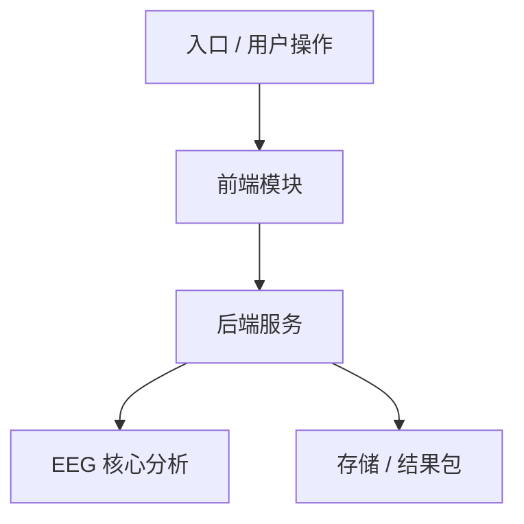

# 架构设计文档模板

## 1. 背景与目标

- 背景：
- 本设计要解决的问题：
- 不解决的问题：

## 2. 设计原则

- 

## 3. 总体架构



## 4. 模块边界

| 模块 | 职责 | 输入 | 输出 | 不负责 |
| --- | --- | --- | --- | --- |
|  |  |  |  |  |

## 5. 数据流

- 输入：
- 中间状态：
- 输出：
- 错误处理：

## 6. 接口 / 契约

- API：
- 文件契约：
- JSON 契约：
- 版本兼容：

## 7. 验收标准

- [ ] 

## 8. 风险与待定问题

- 风险：
- 待定：

## 9. 飞书摘要

```text
本架构设计确认：
影响范围：
开发依据：
下一步：
```
