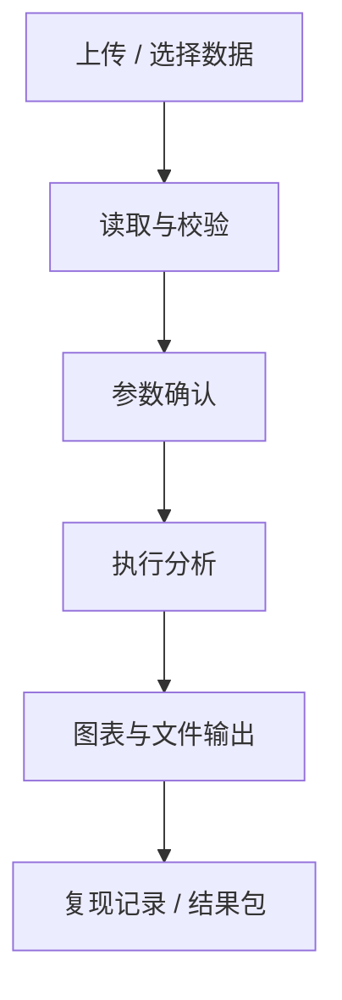

# 模块详细设计文档模板

## 1. 模块信息

- 模块名称：
- 当前状态：实验室 / 预研 / V01 已启用 / 待合并主流程
- 负责人 / 对话来源：
- 更新时间：

## 2. 用户目标

- 研究者要完成什么：
- 需要看懂什么：
- 最终交付给谁：

## 3. 输入设计

| 输入 | 必填 | 格式 | 说明 | 失败提示 |
| --- | --- | --- | --- | --- |
|  |  |  |  |  |

## 4. 参数设计

| 参数 | 默认值 | MNE / 算法对应 | 可编辑 | 验收标准 |
| --- | --- | --- | --- | --- |
|  |  |  |  |  |

## 5. 处理流程



## 6. 输出设计

| 输出 | 类型 | 用途 | 是否进入结果包 | 验收标准 |
| --- | --- | --- | --- | --- |
|  |  |  |  |  |

## 7. 图表质量标准

- 图像尺寸 / dpi：
- 单位和坐标：
- 配色：
- 图注：
- 受试者级表格：

## 8. 科研与风险边界

- 统计单位：
- 人工复核边界：
- 不用于临床诊断：
- 常见误读：

## 9. 验收清单

- [ ] 输入失败状态清晰。
- [ ] 参数与 MNE / 算法名称可对应。
- [ ] 输出图、表、JSON、方法说明可下载或可追溯。
- [ ] 风险边界可见。
- [ ] 可以从实验室独立验证。

## 10. 开发交接

- 需要前端实现：
- 需要后端实现：
- 需要算法实现：
- 需要测试：

## 11. 飞书摘要

```text
模块：
本次确认：
输入输出：
验收标准：
待确认：
```
